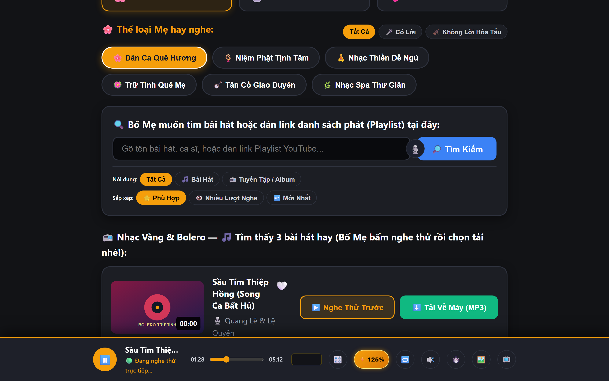
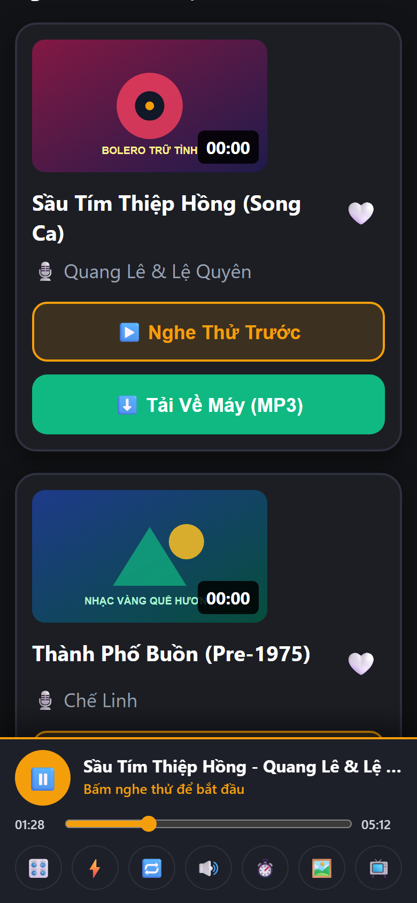
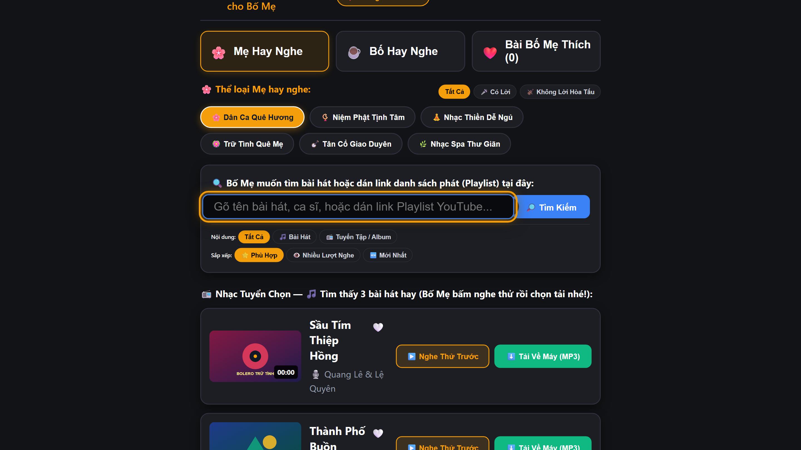

# 🎶 TuneFlow

<div align="center">

**An elegant, elderly-friendly YouTube to MP3/MP4 music downloader with in-app audio preview player. Self-hosted & container-ready (Docker, Podman, VPS, Cloud, Local).**

[](https://github.com/tamld/tuneflow/releases/latest)
[](https://github.com/tamld/tuneflow/actions/workflows/ci.yml)
[](https://github.com/tamld/tuneflow/pkgs/container/tuneflow)
[](#)
[](LICENSE)

[English](README.md) · [Tiếng Việt](README.vi.md) · [User Guide](docs/USER_GUIDE.md) · [Roadmap](docs/ROADMAP.md)

<br />



*✨ SilverMelody Senior-First UX: Large Touch Targets, Real-time Web Audio DSP Equalizer & In-App Preview*

</div>

---

## 🖼️ Interface Showcase

| 📱 Mobile PWA (iOS / Android) | 📺 10-Foot Android TV Leanback |
| :---: | :---: |
|  |  |
| *Pocket audio preview, offline PWA, lock screen media controls* | *Sofa viewing, D-pad spatial navigation, high-contrast gold focus* |

---

## 🌸 Filial Technology Mission & Comparative Benchmark

TuneFlow exists for a singular mission: **Empowering adult children to support their elderly parents' emotional and spiritual wellbeing through music, safely and sustainably.**

| Dimension | Free Web Converters (Y2Mate, etc.) | MeTube / YouTube-DL Web | Spotify / Commercial Apps | 🎶 TuneFlow (For Parents) |
| :--- | :--- | :--- | :--- | :--- |
| **Ads & Malware** | ❌ Full of predatory ads & scams | ⚠️ Clean, but strictly technical UI | ⚠️ Expensive recurring monthly subscription | 🛡️ **100% Ad-Free, zero malware bobby traps** |
| **In-App Auditory Preview** | ❌ None (blind downloads) | ❌ Download required before listening | ✅ Yes | 🎧 **Instant Zero-Disk Audio Preview** |
| **Senior Ergonomics** | ❌ Tiny fonts, cluttered dark patterns | ❌ Complex tech developer layout | ⚠️ Overwhelming menus & auto-shuffle | 👴👵 **SilverMelody Design: Big text, AAA contrast** |
| **Living Room TV Casting** | ❌ Unsupported | ❌ Unsupported | ⚠️ Requires paid account / AirPlay | 📡 **TuneFlow Connect: TV shows PIN, cast from phone** |
| **Physical USB / Car Stereos** | ❌ Cryptic filenames, garbled text | ❌ Raw un-numbered files | ❌ Strict DRM-locked, export forbidden | 💾 **One-Click USB Exporter with 001, 002... numbering** |
| **Music Ownership** | ❌ Vulnerable to site takedowns | ⚠️ Raw local files | ❌ Rental model (access revoked on cancellation) | 🔒 **Permanent family homelab ownership** |

---

## ⚡ 6 Breakthrough Pillars

1. 👴👵 **Senior-First UX ("SilverMelody")**: Giant touch targets ($\ge 56$px), ultra-high contrast (WCAG 2.2 AAA), Dual Day (Warm Cream) and Night modes.
2. 📡 **TuneFlow Connect (Living Room TV Remote-Free Casting)**: The TV displays a prominent 4-digit PIN (`8888`). Family members or seniors choose songs on their mobile device and tap "Cast to TV" — eliminating frustrating TV remote on-screen typing.
3. 💾 **Physical USB / SD Card Bridge**: Automatically discovers connected USB flash drives, copies songs with strict 3-digit zero-padded numbering (`001 - Artist - Title.mp3`), purges macOS metadata junk (`.DS_Store`, `._*`) from FAT32 filesystems, and outputs standard `playlist.m3u` for car stereos, portable FM radios, and chanting boxes. Includes offline batch ZIP exports.
4. 🎧 **Zero-Disk In-App Audio Preview**: Stream and preview tracks instantly with speculative prewarming before downloading.
5. 🎛️ **Web Audio DSP Equalizer**: 3-band presets (Vocal Clarity, Warm Bolero) and 125%–150% volume boost with dynamic range compression for hearing-impaired seniors.
6. 🌸 **Autonomous Engine Self-Healing & Filial Advice**: Automatic daemon updates (`yt-dlp -U`) upon YouTube cipher updates. No intimidating English terminal error traces; gentle 1-click fallback to local library.

---

## 💡 Engineering Reality & Transparent Architecture

As an open-source, non-profit homelab project, TuneFlow maintains radical transparency regarding platform constraints:

1. **OS Code-Signing (macOS Gatekeeper & Windows SmartScreen)**:
   * Commercial developer certificates cost $99/year (Apple) and $300–$500/year (Microsoft EV). Sustaining recurring annual fees for a free community project is economically unviable.
   * **Recommended Path**: Adopt the **Web-First / Docker Homelab** architecture (hosted on a family NAS/Mini PC/Raspberry Pi). Seniors accessing via browser or PWA encounter zero system warnings!
   * **For Desktop Native App**: Simply right-click and select *Open* (macOS) or *More Info -> Run Anyway* (Windows) on initial launch. On macOS, run `xattr -cr /Applications/TuneFlow.app`.
2. **iOS Background Audio Constraints (Apple WebKit Sandbox)**:
   * Apple intentionally freezes background PWA audio tabs when the screen locks to protect App Store revenue.
   * **Pragmatic Solution**: Use the **Ambient Desk Clock (Screen WakeLock API)** mode on iPad/iPhone. Placed on a charging stand in the kitchen or bedside table, the screen remains softly lit with an ambient clock and album cover, playing music all night without interruption. For continuous locked-screen background playback, Android, Android TV, or desktop speakers are recommended.

---

## 📱 Platforms & Downloads

| Platform | Client Type | Download / Link | Background Audio |
| :--- | :--- | :--- | :---: |
| **Windows Desktop** | Native Setup Wizard (Inno Setup 6, Zero-Admin) | [Download Setup.exe](https://github.com/tamld/tuneflow/releases/latest) | ✅ |
| **macOS Desktop** | Turn-key DMG Disk Image (Apple Silicon & Intel) | [Download TuneFlow.dmg](https://github.com/tamld/tuneflow/releases/latest) | ✅ |
| **Linux Desktop** | Standalone Portable Tarball & FreeDesktop App | [Download Linux Assets](https://github.com/tamld/tuneflow/releases/latest) | ✅ |
| **Web Browser** | Desktop (Chrome, Safari, Edge, Firefox) | `http://<server-ip>:3000` | ✅ |
| **iOS / iPadOS** | Standalone PWA | Safari Add to Home Screen | ✅ (Hardware lock screen) |
| **Android Mobile** | Native App / PWA | [Download Mobile APK](https://github.com/tamld/tuneflow/releases/latest) | ✅ |
| **Android TV** | 10-Foot Leanback UI | [Download Android TV APK](https://github.com/tamld/tuneflow/releases/latest) | ✅ |
| **Self-Hosted / Server** | Container (Docker / Podman / Compose) | `ghcr.io/tamld/tuneflow:2.5.0` | ✅ |

---

## 🚀 Quickstart (Docker Compose)

Save as `compose.yaml`:

```yaml
services:
  tuneflow:
    image: ghcr.io/tamld/tuneflow:latest
    container_name: tuneflow
    restart: unless-stopped
    ports:
      - "3000:3000"
    environment:
      - PORT=3000
      - NODE_ENV=production
      - ADMIN_PASSWORD=admin       # Change after first login!
    volumes:
      - ./downloads:/app/downloads  # Media files
      - ./data:/app/data            # SQLite DB
```

Start the service:
```bash
docker compose up -d
```
Access at `http://localhost:3000`. Default login: `admin` / `admin`.

---

## 📚 Documentation Hub

* 📖 **[User Guide](docs/USER_GUIDE.md)**: Action-first installation manual for iOS PWA, Android, Android TV, and Docker.
* ⚙️ **[Configuration Reference](docs/CONFIG.md)**: Full list of environment variables, quotas, and security flags.
* 🌐 **[Reverse Proxy Recipes](docs/REVERSE_PROXY.md)**: Ready-to-use configurations for Traefik v3, Nginx, Caddy 2, and Cloudflare Tunnel.
* 🗺️ **[Roadmap](docs/ROADMAP.md)**: Product development roadmap across Phase 1 through Phase 11.
* 📜 **[Changelog](CHANGELOG.md)**: Release history, upgrade notes, and bug fixes.
* 🏛️ **[Architecture & Specs](docs/PRD.md)**: Full PRD, SRS, FSM, and compliance documents.

---

## 📄 License

TuneFlow is licensed under the [MIT License](LICENSE).
