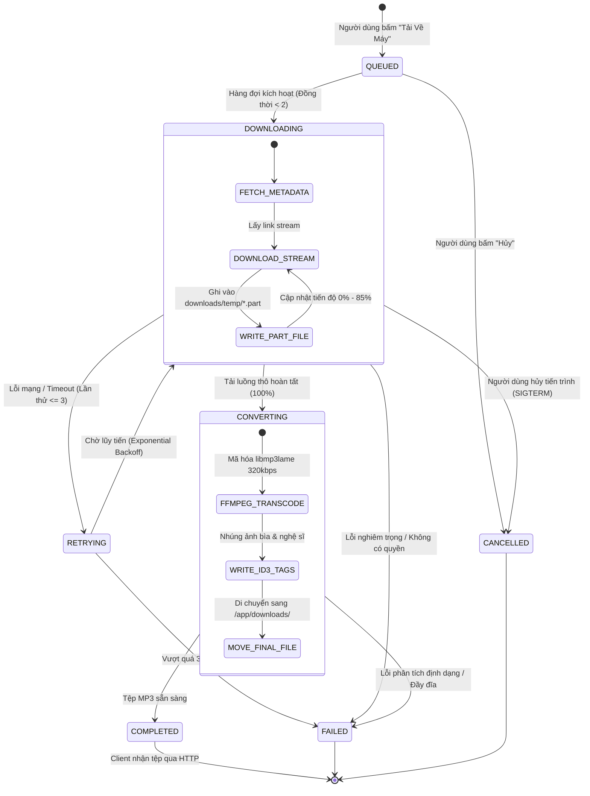
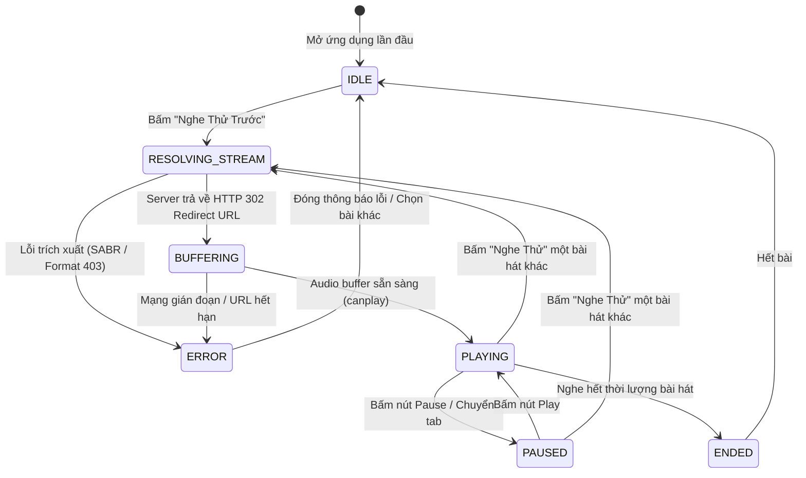
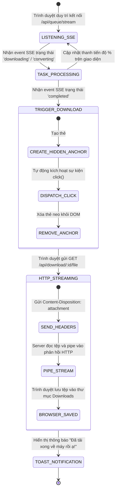

# Đặc Tả Máy Trạng Thái Hữu Hạn (Finite State Machine - FSM)
## Dự Án: TuneFlow

> **Mã tài liệu**: `TUNEFLOW-FSM-01`  
> **Phiên bản**: `1.0.0`  
> **Mục tiêu**: Định nghĩa hình thức và trực quan hóa các chu kỳ trạng thái của hệ thống tải, trình phát nhạc và luồng chuyển giao tệp.

---

## 1. Máy Trạng Thái Hàng Đợi Tải Xuống (Download Queue FSM)

Mỗi tác vụ tải trong hệ thống tuân thủ một chu trình trạng thái đơn hướng có điểm dừng và khả năng phục hồi lỗi nghiêm ngặt:

### Bảng Chuyển Trạng Thái Hàng Đợi (Queue State Transition Matrix)

| Trạng thái hiện tại | Sự kiện kích hoạt (Event) | Điều kiện bảo vệ (Guard) | Trạng thái tiếp theo | Hành động thực thi (Action) |
| :--- | :--- | :--- | :--- | :--- |
| `INITIAL` | `ENQUEUE_TASK` | URL hợp lệ, chưa đầy hàng đợi | `QUEUED` | Thêm vào Map, phát sự kiện SSE `broadcast()` |
| `QUEUED` | `DISPATCH_WORKER` | `activeCount < MAX_CONCURRENT_DOWNLOADS` | `DOWNLOADING` | Khởi chạy `yt-dlp` spawn child process |
| `QUEUED` | `USER_CANCEL` | Task ID tồn tại trong hàng đợi | `CANCELLED` | Cập nhật status, giải phóng tài nguyên |
| `DOWNLOADING` | `STREAM_CHUNK_RECEIVED`| Luồng stream đang tải | `DOWNLOADING` | Cập nhật phần trăm tiến độ, tốc độ MB/s |
| `DOWNLOADING` | `STREAM_FINISHED` | `code === 0` | `CONVERTING` | Gọi `FFmpeg` transcode 320kbps |
| `DOWNLOADING` | `PROCESS_ERROR` | `retries < 3` | `RETRYING` | Tăng biến đếm `retries++`, giữ nguyên tệp `.part` |
| `DOWNLOADING` | `PROCESS_ERROR` | `retries >= 3` | `FAILED` | Ghi log lỗi, gửi thông báo tiếng Việt |
| `CONVERTING` | `TRANSCODE_SUCCESS` | Tệp MP3 tồn tại trên đĩa | `COMPLETED` | Lưu đường dẫn tệp hoàn tất, phát SSE |
| `CONVERTING` | `FFMPEG_ERROR` | FFmpeg thoát mã $\ne 0$ | `FAILED` | Dọn dẹp tệp tạm, báo lỗi |

---

## 2. Máy Trạng Thái Trình Nghe Thử Trực Tiếp (In-App Audio Player FSM)

Trình phát nhạc dưới đáy màn hình điều khiển đối tượng HTML5 `Audio()` chạy trên trình duyệt:

---

## 3. Máy Trạng Thái Luồng Chuyển Giao Tệp Về Máy Cá Nhân (Client Delivery Pipeline FSM)

Đảm bảo tệp MP3 sau khi xử lý tại máy chủ sẽ tự động lưu vào máy của Ba Mẹ:

