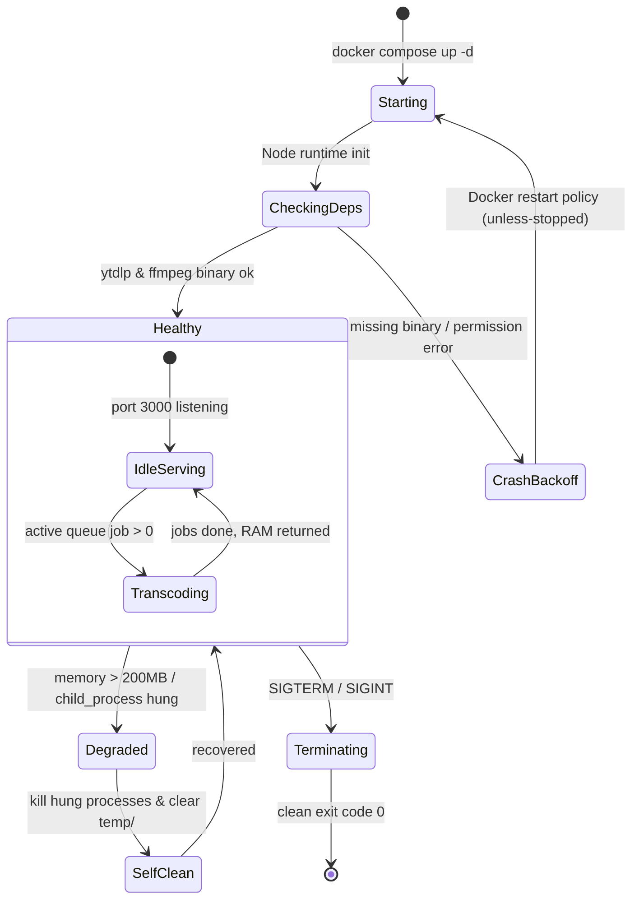

# FSM — Phase 2: Container Lifecycle & Auto-Recovery State Machine

## State Transitions
1. **Starting ➔ CheckingDeps**: Spawns Node.js process, validates environment variables, and verifies write permissions on `downloads/`.
2. **CheckingDeps ➔ Healthy**: Confirms `ffmpeg -version` and `yt-dlp --version` execution success. Binds port 3000.
3. **Healthy ➔ Degraded**: Memory utilization exceeds threshold or a child process hangs past timeout (600s).
4. **Degraded ➔ SelfClean**: Automatically terminates dangling child processes and sweeps orphaned `.part` files.
5. **Terminating ➔ Exit**: Traps `SIGTERM` / `SIGINT` from Docker host, gracefully flushes active connections, and exits with code 0.
