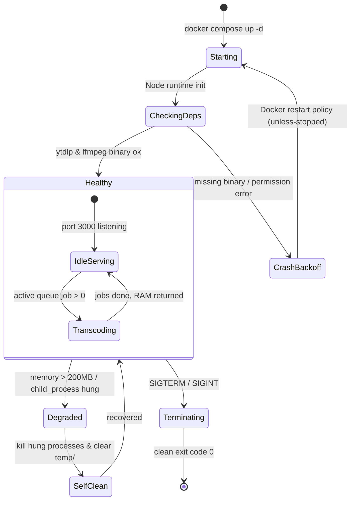

# FSM — Phase 2: Container Lifecycle & Auto-Recovery State Machine

## Các Bước Chuyển Trạng Thái:
1. **Starting ➔ CheckingDeps**: Khởi động Node process, kiểm tra biến môi trường và quyền ghi thư mục `downloads/`.
2. **CheckingDeps ➔ Healthy**: Xác nhận lệnh `ffmpeg -version` và `yt-dlp --version` thực thi thành công. Mở cổng 3000.
3. **Healthy ➔ Degraded**: Bộ nhớ vượt ngưỡng hoặc tiến trình con bị treo quá thời gian timeout (600s).
4. **Degraded ➔ SelfClean**: Tự động giải phóng tiến trình con và dọn sạch tệp rác `.part`.
5. **Terminating ➔ Exit**: Nhận tín hiệu `SIGTERM` từ Docker, đóng toàn bộ kết nối và thoát sạch sẽ.
