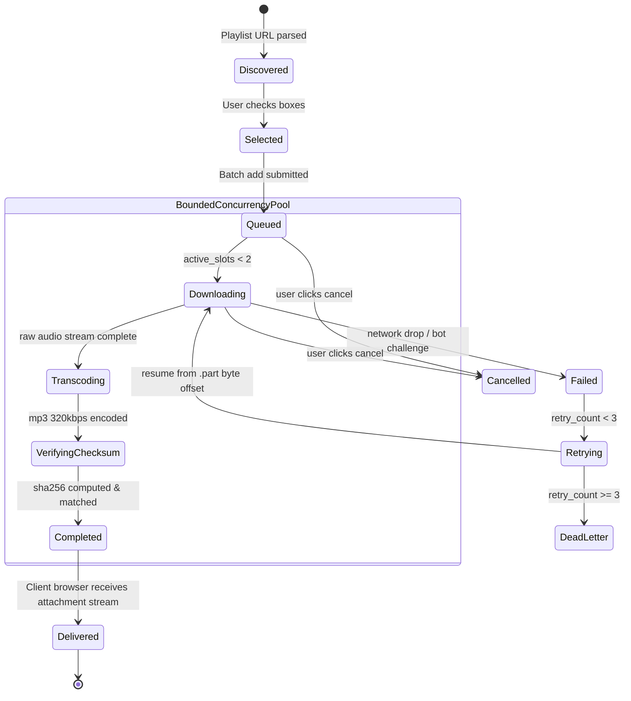

# FSM — Phase 3: Playlist Batch Queue & Item Lifecycle State Machine

## Giải Thích Trạng Thái:
1. **Discovered ➔ Selected**: Danh sách bài hát được hiển thị cho người dùng chọn lọc.
2. **Queued ➔ Downloading**: Chỉ chuyển sang tải khi số lượng slot đang chạy $< 2$.
3. **Transcoding ➔ VerifyingChecksum**: FFmpeg trích xuất âm thanh MP3, sau đó NodeJS stream tệp qua thuật toán `crypto.createHash('sha256')`.
4. **VerifyingChecksum ➔ Completed**: Tệp đạt chất lượng 320kbps, mã băm hợp lệ, sẵn sàng bàn giao cho người dùng.
5. **Retrying**: Tự động khôi phục tải từ tệp tạm `.part` khi rớt mạng tối đa 3 lần.
