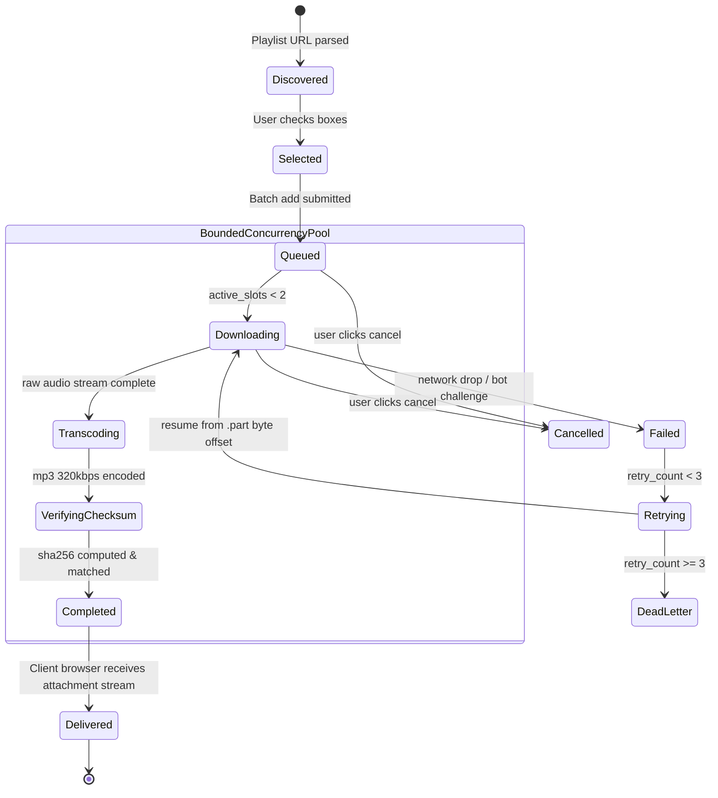

# FSM — Phase 3: Playlist Batch Queue & Item Lifecycle State Machine

## State Explanations
1. **Discovered ➔ Selected**: Tracklist parsed and presented for user review and multi-selection.
2. **Queued ➔ Downloading**: Transitions to active download when running execution slots $< 2$.
3. **Transcoding ➔ VerifyingChecksum**: FFmpeg extracts MP3 audio, followed by streaming SHA-256 hash calculation via `crypto.createHash('sha256')`.
4. **VerifyingChecksum ➔ Completed**: Audio matches 320kbps fidelity, checksum verified, ready for client delivery.
5. **Retrying**: Resumes downloads up to 3 times from `.part` offsets upon transient network drops.
