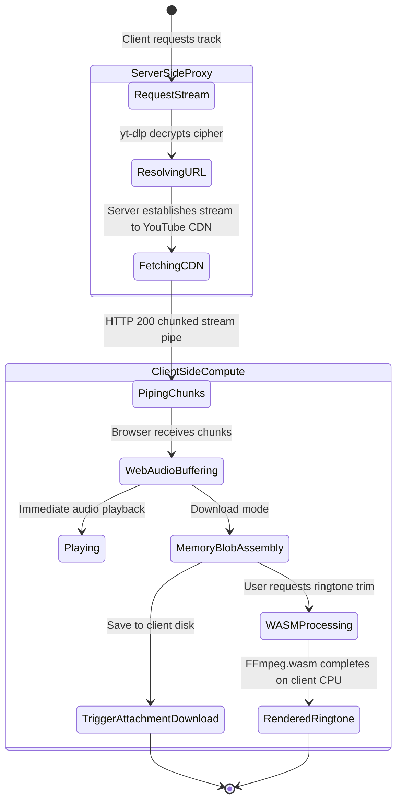

# FSM — Phase 5: Stream Pipelining & Hybrid Compute State Machine

```mermaid
stateDiagram-v2
    [*] --> RequestStream: Client requests track
    
    state ServerSideProxy {
        RequestStream --> ResolvingURL: yt-dlp decrypts cipher
        ResolvingURL --> FetchingCDN: Server establishes stream to YouTube CDN
        FetchingCDN --> PipingChunks: HTTP 200 chunked stream pipe
    }
    
    state ClientSideCompute {
        PipingChunks --> WebAudioBuffering: Browser receives chunks
        WebAudioBuffering --> Playing: Immediate audio playback
        
        WebAudioBuffering --> MemoryBlobAssembly: Download mode
        MemoryBlobAssembly --> TriggerAttachmentDownload: Save to client disk
        
        MemoryBlobAssembly --> WASMProcessing: User requests ringtone trim
        WASMProcessing --> RenderedRingtone: FFmpeg.wasm completes on client CPU
    }
    
    TriggerAttachmentDownload --> [*]
    RenderedRingtone --> [*]
```
