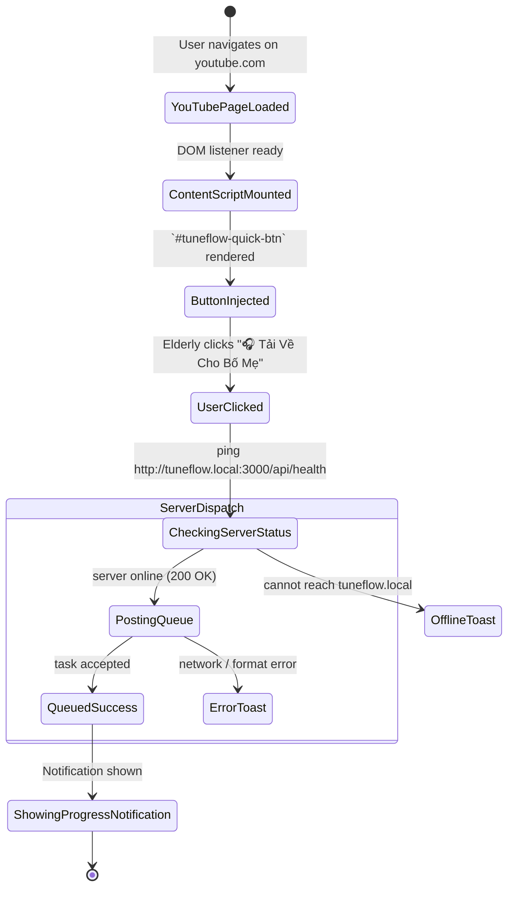

# FSM — Phase 6: Browser Extension Interaction State Machine

```mermaid
stateDiagram-v2
    [*] --> YouTubePageLoaded: User navigates on youtube.com
    YouTubePageLoaded --> ContentScriptMounted: DOM listener ready
    ContentScriptMounted --> ButtonInjected: `#tuneflow-quick-btn` rendered
    
    ButtonInjected --> UserClicked: Elderly clicks "🎧 Tải Về Cho Bố Mẹ"
    UserClicked --> CheckingServerStatus: ping http://tuneflow.local:3000/api/health
    
    state ServerDispatch {
        CheckingServerStatus --> PostingQueue: server online (200 OK)
        PostingQueue --> QueuedSuccess: task accepted
        PostingQueue --> ErrorToast: network / format error
    }
    
    CheckingServerStatus --> OfflineToast: cannot reach tuneflow.local
    
    QueuedSuccess --> ShowingProgressNotification: Notification shown
    ShowingProgressNotification --> [*]
```
