# SPEC-0012: Cryptographic Two-Tier Self-Update & Windows Package Manager Distribution

## 1. Metadata & Status
- **Specification ID**: `SPEC-0012`
- **Phase**: Phase 14 (`v2.6.0`)
- **Status**: `Draft / Ready for Implementation (SSoT)`
- **Category**: Security, Reliability & Distribution
- **Author**: Tam Le Duc (`anh Tam`) & AI Engineering Pair
- **Date**: 2026-09-11

---

## 2. Problem Statement & Motivation
In self-hosted and native desktop deployments, two critical failure modes threaten continuous operation:
1. **YouTube Extraction Cipher Drift (HTTP 403 Forbidden)**: YouTube frequently updates stream extraction signatures and bot verification algorithms (n-token challenges, JS ciphers). When this happens, `yt-dlp` fails with HTTP 403 until upgraded to the latest binary. Non-technical senior users cannot open a terminal to run update commands.
2. **Untrusted Core Binary Updates & Windows File Locks**: Updating running executables on Windows raises `ERROR_SHARING_VIOLATION`. Furthermore, downloading executable updates over HTTP without cryptographic non-repudiation creates an arbitrary code execution vector.
3. **Distribution Barrier**: Users require SmartScreen-free, automated 1-command installation via official Windows package managers (`WinGet` and `Scoop`).

---

## 3. Architecture & Two-Tier Update Topology

```mermaid
flowchart TD
    subgraph Tier1["Tier 1: Upstream Engine Self-Healing"]
        E1["YouTube Extraction Request"] --> E2{"Encounter 403 / Cipher Error?"}
        E2 -- Yes --> E3["isCipher403Error() Detector Triggered"]
        E3 --> E4["Non-blocking Background yt-dlp Auto-Update"]
        E4 --> E5["Verify Pre-flight Hash / Release"]
        E5 --> E6["Retry Track Extraction (Transparent to User)"]
        E2 -- No --> E7["Continue Standard Playback"]
    end

    subgraph Tier2["Tier 2: Core Server Cryptographic Update"]
        C1["Core Update Manifest (SHA256SUMS.txt)"] --> C2["Ed25519 Detached Signature Check (.sig)"]
        C2 --> C3{"verifyEd25519() Authenticated?"}
        C3 -- No --> C4["FAIL-CLOSED: Reject Update & Alert Admin"]
        C3 -- Yes --> C5["Verify Target Binary SHA-256 CAS"]
        C5 --> C6["atomicSwapExecutable(): .exe -> .exe.old"]
        C6 --> C7["Drop New Verified Binary & Restart"]
    end
```

---

## 4. Technical Requirements & Invariants

### 4.1 Tier 1: YouTube 403 Cipher Auto-Healing
- **Function**: `isCipher403Error(errorText)` in `src/security/update_verifier.js`.
- **Trigger Patterns**:
  - `HTTP Error 403: Forbidden`
  - `Unable to extract signature`
  - `Unable to extract n-token`
  - `Sign in to confirm you’re not a bot`
- **SLA**: Trigger background update with debouncing (maximum 1 check per 10 minutes) so repeated search requests do not hammer GitHub releases.

### 4.2 Tier 2: Ed25519 Cryptographic Verification
- **Algorithm**: Pure Ed25519 (`crypto.verify(null, data, publicKey, signature)`).
- **Public Key Invariant**: Embedded in application configuration (`update_verifier.js`).
- **Signature Format**: Base64 encoded raw Ed25519 signature.
- **Fail-Closed Security**: Any altered byte in `SHA256SUMS.txt` or the binary causes immediate throwing of `SECURITY_INTEGRITY_VIOLATION`.

### 4.3 Windows Atomic Swap
- Module: `src/security/binary_guard.js` -> `atomicSwapExecutable(currentPath, newPath)`.
- Replaces running binary without triggering `ERROR_SHARING_VIOLATION`.
- Leaves `.old` for rollback, cleaned on subsequent boot.

### 4.4 Package Manager Manifests
- **WinGet**: `packaging/winget/tamld.TuneFlow.yaml` adhering to schema `v1.6.0` singleton.
- **Scoop**: `packaging/scoop/tuneflow.json` supporting `checkver` and `autoupdate`.

---

## 5. Acceptance Criteria (DoD)
- [x] Ed25519 keypair generation and verification implemented in `src/security/update_verifier.js`.
- [x] Manifest verification parser parses valid hashes and throws on signature tampering.
- [x] Cipher 403 error detector accurately detects YouTube cipher shifts and bot checks.
- [x] WinGet manifest created at `packaging/winget/tamld.TuneFlow.yaml`.
- [x] Scoop manifest created at `packaging/scoop/tuneflow.json`.
- [x] Automated test suite `tests/phase14-update-and-packaging.test.js` passing 100%.
