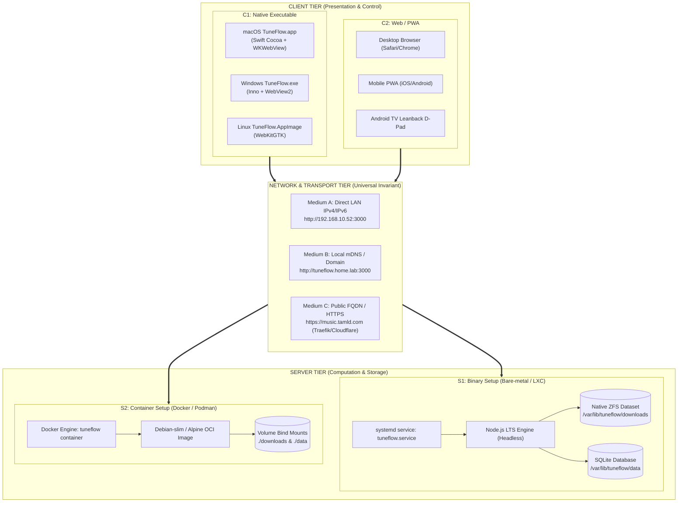
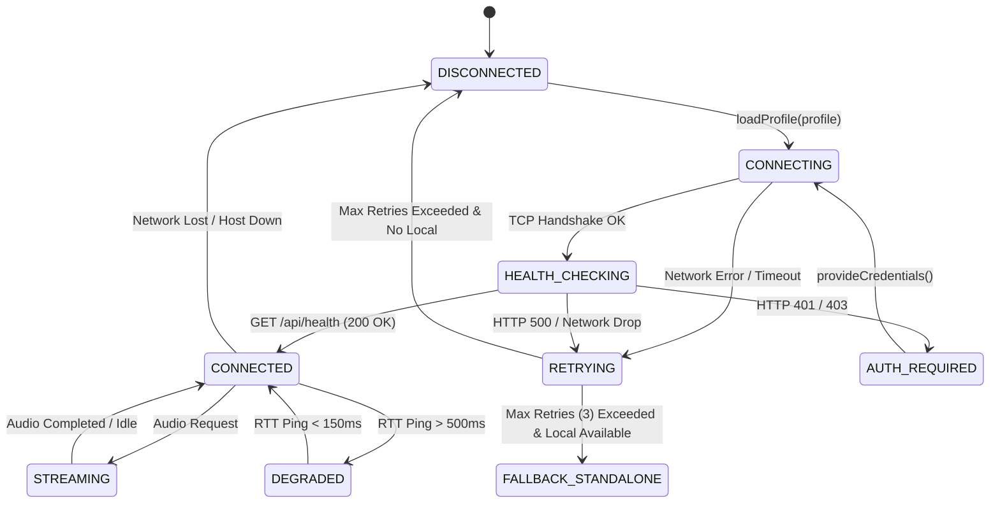

# 📐 SPEC-0013: TRI-MODE DEPLOYMENT, REMOTE HOMELAB TOPOLOGY & MATRIX PROVING ARCHITECTURE

> **Project Name:** TuneFlow Tri-Mode Deployment & Decoupled Homelab Ecosystem  
> **Document Code:** SPEC-0013  
> **Approval Status:** ✅ Approved by IT Administrator (anh Tâm)  
> **Traceability:** RM-31 (Tri-Mode Selection), RM-32 (Decoupled Client FQDN), RM-33 (ZFS Server Parity), RM-34 (Connection FSM Proving)  
> **Includes:** System Architecture, 2x2 Operational Matrix, Deployment Strategy, Operational Runbook, Testing/Proving Plan, and Security Hardening.

---

## 📌 1. ARCHITECTURAL OBJECTIVES & SCOPE

### 1.1 Objectives
1. **Pillar 1 (Full Standalone Mode)**: Enable 1-click self-contained installation deploying both Native UI and background system service (`launchd` on macOS, `systemd --user` on Linux, Task Scheduler on Windows) with zero manual terminal commands.
2. **Pillar 2 (Dedicated Server Mode)**: Deliver headless deployment for Homelab infrastructure (Proxmox LXC/CT122, Docker, Linux VMs) optimized for 24/7 background operation, ZFS storage hygiene, and zero GUI overhead.
3. **Pillar 3 (Dedicated Thin Client Mode)**: Provide a featherweight native desktop client (~10 MB, zero Node.js/yt-dlp dependencies) connecting to any server via direct LAN IPv4/IPv6, mDNS/local domain, or public FQDN via HTTPS.
4. **Pillar 4 (Universal Connection Protocol)**: Formalize a resilient HTTP/REST + Range-streaming wire contract supporting auto-reconnect, multi-profile management, and state machine proving.

### 1.2 Target Matrix Taxonomy

The system architecture divides strictly across two independent axes:

```text
               ┌─────────────────────────────────────────────────────────────┐
               │                        SERVER SIDE                          │
               ├──────────────────────────────┬──────────────────────────────┤
               │   Option S1: Binary Setup    │  Option S2: Container Setup  │
               │  (Bare-metal, Proxmox LXC,   │ (Docker, Podman, Kubernetes, │
               │      native systemd daemon)  │         Docker Compose)      │
┌──────────────┼──────────────────────────────┼──────────────────────────────┤
│  Option C1:  │         Quadrant Q1          │         Quadrant Q2          │
│ File Execute │  (Apple Silicon Thin Client  │ (Native Desktop App pointing │
│  (Native App │     pointing directly to     │    to Docker/Traefik host    │
│  .app / .exe)│    Proxmox CT122 ZFS pool)   │     with SSL Domain FQDN)    │
C──────────────┼──────────────────────────────┼──────────────────────────────┤
L  Option C2:  │         Quadrant Q3          │         Quadrant Q4          │
I   Web / PWA  │ (Browser / Android TV direct │  (PWA / Mobile Browser via   │
E (Browser UI) │   LAN IP access to baremetal │   Public HTTPS Cloudflare/   │
N              │         LXC service)         │       Traefik endpoint)      │
T──────────────┴──────────────────────────────┴──────────────────────────────┘
```

---

## 🏗️ 2. SYSTEM ARCHITECTURE & TOPOLOGY



---

## 🔌 3. CONNECTION MATRICES & PROTOCOL CONTRACT

### 3.1 Exhaustive 4-Quadrant Connection Matrix

| Matrix ID | Server Environment | Client Environment | Transport Medium | Authentication | Streaming Mechanism | Failover & Resilience |
| :--- | :--- | :--- | :--- | :--- | :--- | :--- |
| **Q1-LXC-APP** | **S1: Binary LXC** (CT122, ZFS) | **C1: Native App** (Mac Mini M4) | Local IPv4 / mDNS (Port 3000) | Optional Local Bearer / Guest Guard | HTTP 206 Partial Content (Direct HW Audio) | Auto-reconnect with 3s exponential backoff |
| **Q2-DOC-APP** | **S2: Container** (Docker Compose) | **C1: Native App** (Mac / Win) | Public FQDN (HTTPS TLS 1.3) | Header `Authorization: Bearer <token>` | Proxied Range Pipe via Traefik reverse proxy | Ping health check + Offline degraded banner |
| **Q3-LXC-WEB** | **S1: Binary LXC** (CT122, ZFS) | **C2: Web / PWA** (Android TV / iPad) | Local LAN IPv4 | Session Cookie / Guest Quota | HTML5 Audio native browser buffering | PWA Offline Shell with network-first fallback |
| **Q4-DOC-WEB** | **S2: Container** (Docker / Cloudflare) | **C2: Web / PWA** (Mobile 4G) | Public FQDN (WAF + HTTPS) | JWT / Admin Credentials | Chunked Audio Pipe (WASM offloaded DSP) | Service Worker background sync cache |

### 3.2 Client Connection State Machine (FSM)



### 3.3 Client Configuration Profile Schema (`client-config.json`)

```json
{
  "$schema": "http://json-schema.org/draft-07/schema#",
  "title": "TuneFlowClientConfig",
  "type": "object",
  "properties": {
    "version": { "type": "string", "default": "1.0.0" },
    "activeProfile": { "type": "string", "default": "default" },
    "profiles": {
      "type": "object",
      "additionalProperties": {
        "type": "object",
        "properties": {
          "name": { "type": "string" },
          "url": { "type": "string", "format": "uri" },
          "authToken": { "type": "string" },
          "timeoutMs": { "type": "integer", "default": 5000 },
          "isLocalDaemon": { "type": "boolean", "default": false }
        },
        "required": ["name", "url"]
      }
    },
    "behavior": {
      "type": "object",
      "properties": {
        "autoReconnect": { "type": "boolean", "default": true },
        "maxReconnectAttempts": { "type": "integer", "default": 3 },
        "fallbackToStandalone": { "type": "boolean", "default": false }
      }
    }
  },
  "required": ["activeProfile", "profiles"]
}
```

---

## 🚀 4. TRI-MODE DEPLOYMENT STRATEGY

### 4.1 Mode 1: Full / All-in-One Deployment (Desktop + System Service)
* **Installer Actions**:
  1. Unpacks Node.js runtime, production bundle, `yt-dlp`, and `ffmpeg` into `/Applications/TuneFlow.app` (macOS) or `%LOCALAPPDATA%\Programs\TuneFlow` (Windows).
  2. Registers and enables the background daemon:
     - **macOS (`~/Library/LaunchAgents/com.tamld.tuneflow.plist`)**:
       Configures `RunAtLoad=true` and `KeepAlive=true` for `/Applications/TuneFlow.app/Contents/MacOS/TuneFlow --daemon`.
     - **Linux (`~/.config/systemd/user/tuneflow.service`)**:
       Enabled via `systemctl --user enable --now tuneflow.service`.
  3. Launches native desktop window connecting to `http://127.0.0.1:3000`.

### 4.2 Mode 2: Dedicated Headless Server Deployment (Proxmox LXC / Docker)
* **Option S1 (Binary / LXC)**:
  - Deployed via turnkey script: `bash -c "$(curl -fsSL https://raw.githubusercontent.com/tamld/tuneflow/master/installer/server/install.sh)"`.
  - Installs to `/opt/tuneflow` with dedicated system user `tuneflow:tuneflow`.
  - Maps persistent database to `/var/lib/tuneflow/data` and media to `/var/lib/tuneflow/downloads` (configured on ZFS pool mount).
  - Registers `/etc/systemd/system/tuneflow.service` with auto-restart.
* **Option S2 (Container / Docker Compose)**:
  - Headless image `ghcr.io/tamld/tuneflow:latest`.
  - Zero X11/WebKit dependencies. Memory capped at 256MB, CPU capped at 1.5 cores.
  - Exposes port 3000 with Traefik/Cloudflare Tunnel integration.

### 4.3 Mode 3: Dedicated Thin Client Deployment
* **Client Characteristics**:
  - Binary size: **< 12 MB**.
  - **Zero Server Dependencies**: Does NOT bundle Node.js, `node_modules`, `yt-dlp`, or `ffmpeg`.
  - Installer creates desktop shortcut and registers standard macOS Preferences window (`Cmd + ,`) allowing instant server switching between:
    - `[🔘 Proxmox Homelab (http://192.168.10.52:3000)]`
    - `[⚪ Public Cloud (https://music.tamld.com)]`
    - `[⚪ Custom IP / Domain]`

---

## ⚙️ 5. OPERATIONAL STRATEGY (VẬN HÀNH & QUẢN TRỊ)

1. **Auto-Healing & Supervision**:
   - `systemd` / Docker restart policy: `Restart=always` with `RestartSec=5s`.
   - Health check watchdog: `/api/health` polled every 30s. If unresponsive for 3 consecutive probes, container/daemon restarts cleanly.
2. **ZFS Storage Hygiene & Quota Guard**:
   - Automated maintenance engine (`src/engine/maintenance.js`) runs every 60 minutes.
   - Enforces `MAX_STORAGE_MB` (e.g. 100GB on ZFS) using LRU eviction for downloaded MP3s older than `DOWNLOAD_TTL_HOURS`.
   - Cleans orphaned temporary conversion fragments in `/temp` every 6 hours.
3. **Process Concurrency Limits**:
   - Server strictly caps active downloads (`MAX_DOWNLOADS=2`) and transcoding conversions (`MAX_CONVERSIONS=1`) to prevent CPU starvation on low-power homelab nodes.
4. **Log Rotation & Telemetry**:
   - Structured JSON logging. Zero plaintext logging of cookies, user passwords, or tokens.
   - `journalctl -u tuneflow -f` on systemd; `docker logs --tail=100 -f tuneflow` on container.

---

## 🧪 6. TESTING & PROVING STRATEGY (/prove VALIDATION PLAN)

The Tri-Mode architecture must be mathematically and mechanically proven across all 4 quadrants:

### 6.1 Test Levels
1. **Level 1: URL & Profile Schema Parser Gate**:
   - Validates IPv4 (`192.168.x.x`), IPv6 (`[::1]`), mDNS (`.local`), local domains (`.home.lab`), and HTTPS FQDNs.
   - Proves malformed URLs, missing schemes, and port overflows are rejected fail-closed.
2. **Level 2: Client Connection State Machine Proving**:
   - Simulates transitions: `DISCONNECTED` -> `CONNECTING` -> `CONNECTED` -> `DEGRADED` -> `RETRYING` -> `FALLBACK`.
   - Proves retry counters increment accurately and adhere to exponential backoff.
3. **Level 3: Hermetic Mock Server Matrix**:
   - Spawns in-memory HTTP and HTTPS servers.
   - Proves Client connects, validates `/api/health`, parses headers, and receives Range-streamed audio without hanging.
4. **Level 4: Server Operational Headless Verification**:
   - Proves server executes cleanly without GUI dependencies and respects environment overrides.

---

## 🛡️ 7. SECURITY STRATEGY & DEFENSE-IN-DEPTH

1. **Network Transport Security**:
   - Strict HTTPS enforcement when connecting over public FQDNs.
   - Rejects unencrypted HTTP connections over non-RFC1918 private IP ranges.
2. **CORS & Origin Hardening**:
   - Configurable `ALLOWED_CLIENT_ORIGINS`. Server rejects arbitrary cross-origin requests from malicious websites.
3. **Reverse Proxy & SSRF Defense**:
   - `isSafeRemoteStreamUrl()` strictly blocks requests resolving to loopback (`127.0.0.1`), LAN gateways, or AWS metadata endpoints (`169.254.169.254`).
   - Server trusts `X-Forwarded-For` only when `TRUST_PROXY=true`.
4. **Client Secret Storage**:
   - Saved auth tokens in `client-config.json` are stored with user-only file permissions (`chmod 600` on macOS/Linux).
5. **Fail-Closed Binary Integrity (CAS Gate)**:
   - All server binaries (`yt-dlp`, `ffmpeg`) must match SHA-256 integrity sums in `SHA256SUMS.json` before execution.
