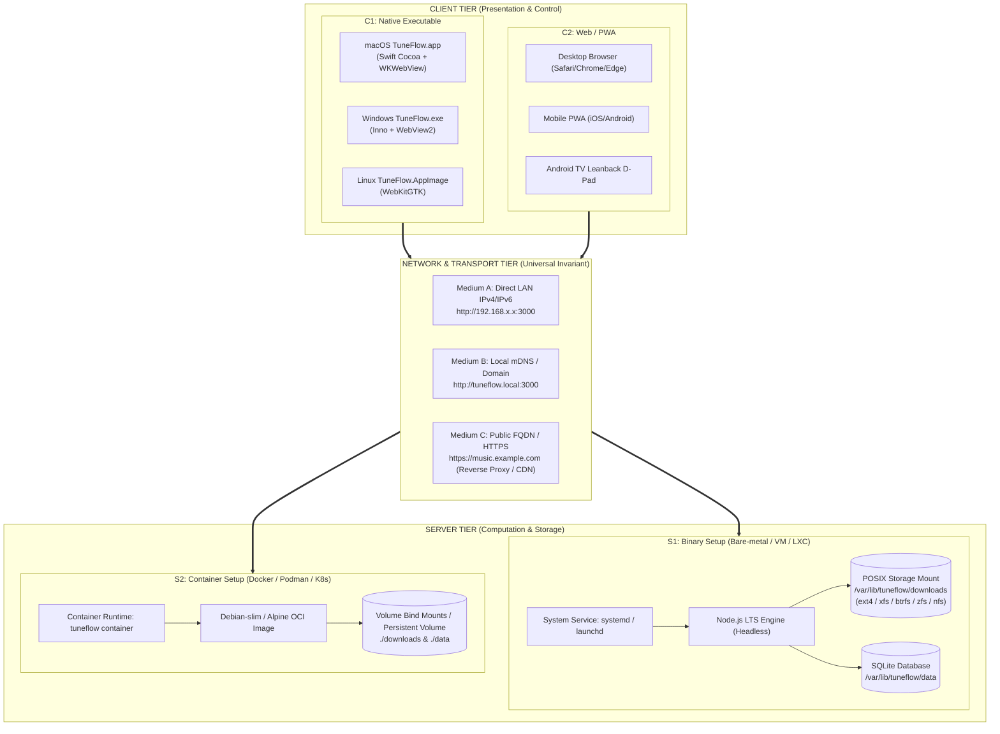
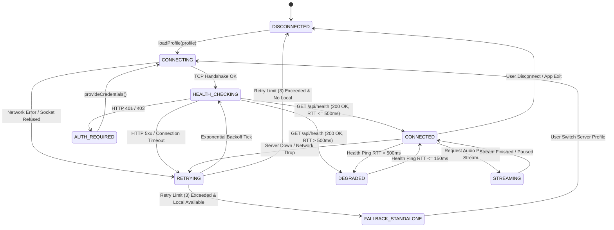

# 📐 SPEC-0013: TRI-MODE DEPLOYMENT, REMOTE SERVER TOPOLOGY & MATRIX PROVING ARCHITECTURE

> **Project Name:** TuneFlow Tri-Mode Deployment & Decoupled Architecture Suite  
> **Document Code:** SPEC-0013 (Phase 15 - v3.0.0 Foundation)  
> **Approval Status:** ✅ Approved by IT Administrator (anh Tâm)  
> **Traceability:** RM-31 (Tri-Mode Selection), RM-32 (Decoupled Client FQDN), RM-33 (Storage-Agnostic Headless Server), RM-34 (Connection FSM Proving)  
> **Complete Dossier Includes:** PRD, SRS, FSM Transition Truth Table, DoR, DoD, Acceptance Criteria (AC), Validation & Automation Test Plan.

---

## 📌 1. PRD (PRODUCT REQUIREMENTS DOCUMENT)

### 1.1 Project Objectives
1. **Pillar 1 (Full Standalone Mode)**: Enable 1-click self-contained installation deploying both Native UI and background system service (`launchd` on macOS, `systemd --user` on Linux, Task Scheduler on Windows) with zero manual terminal commands.
2. **Pillar 2 (Dedicated Headless Server Mode)**: Deliver a headless, multi-environment backend for Linux hosts, containers, virtual machines, and cloud VPS instances. Supports **any standard POSIX filesystem** (ext4, XFS, Btrfs, ZFS, APFS, NFS/SMB mounts) with 24/7 background operation, storage hygiene, and zero GUI overhead.
3. **Pillar 3 (Dedicated Thin Client Mode)**: Provide a featherweight native desktop client (~10 MB, zero Node.js/yt-dlp dependencies) connecting to any remote server via direct LAN IPv4/IPv6, mDNS/local domain, or public FQDN via HTTPS.
4. **Pillar 4 (Universal Connection Protocol)**: Formalize a resilient HTTP/REST + Range-streaming wire contract supporting auto-reconnect, multi-profile management, and state machine proving.

### 1.2 Problem Statement & Context
- **Storage Duplication & SSD Wear Barrier**: Running a full backend on lightweight laptops/desktops duplicates storage, exhausts local SSD write lifecycles during heavy transcoding, and isolates downloaded music from other family devices (Android TV, mobile phones).
- **Setup Friction Barrier**: Non-technical users cannot configure remote servers or Docker Compose files without terminal literacy.
- **Monolithic Entanglement**: Previous desktop packaging (SPEC-0010) tightly bundled the backend inside the client wrapper, preventing thin-client access to dedicated headless home servers or cloud VPS instances.

### 1.3 Target Audience & Stakeholders
- **Homelab Operators & IT Administrators**: Want a dedicated headless server daemon running 24/7 on Linux/Container infrastructure with storage-agnostic persistence.
- **Desktop Users (macOS, Windows, Linux)**: Want a lightweight, responsive native music player with zero background battery drain.
- **Family Members (Elderly & Mobile)**: Want zero-friction access via Web browser, Android TV Leanback, or PWA without installing servers locally.

### 1.4 Core Functional Requirements
1. **[REQ-TRI-01] Mode 1 - Full Standalone Deployment**: Installs both Native UI and background system service (`launchd` on macOS, `systemd --user` on Linux). Auto-starts on boot and connects to `http://127.0.0.1:3000`.
2. **[REQ-TRI-02] Mode 2 - Dedicated Headless Server**: Deploys a 100% headless daemon on Linux/Docker/VMs with zero GUI dependencies, respecting POSIX storage descriptors (`DATA_DIR`, `DOWNLOADS_DIR`, `TEMP_DIR`) across any filesystem.
3. **[REQ-TRI-03] Mode 3 - Dedicated Thin Client**: Deploys a <12MB native client binary with 0% Node.js / yt-dlp dependencies, supporting remote server connection.
4. **[REQ-TRI-04] Universal Network Medium Support**: Thin client and Web clients must connect over direct LAN IPv4/IPv6 (`http://192.168.x.x:3000`), local mDNS (`http://tuneflow.local:3000`), or public FQDN (`https://music.example.com`).
5. **[REQ-TRI-05] In-App Server Switching & Profile Management**: Provides standard Preferences dialog (`Cmd + ,` on macOS) to save and switch server profiles in `client-config.json` with user-only permissions (`chmod 600`).
6. **[REQ-TRI-06] Connection State Machine & Auto-Healing**: Implements a formal Finite State Machine (FSM) with pre-flight health check, exponential backoff reconnect, latency degradation detection (>500ms), and graceful fallback.

---

## 💻 2. SRS (SOFTWARE REQUIREMENTS SPECIFICATION)

### 2.1 Runtime Environment & Target Platforms
- **Server Runtimes**: Node.js >= 20.0.0 (LTS recommended: Node.js 22 LTS), Linux bare-metal (glibc 2.31+ / musl), OCI Containers (Docker, Podman), Virtual Machines, Cloud VPS.
- **Client Runtimes**: macOS 12 Monterey through macOS 15 Sequoia (Apple Silicon & Intel), Windows 10/11 (WebView2), Linux (WebKitGTK).
- **Web Runtimes**: Modern Chromium (>=109), Safari (>=15.4), Firefox (>=115).

### 2.2 System Architecture & 4-Quadrant Operational Matrix

```text
               ┌─────────────────────────────────────────────────────────────┐
               │                        SERVER SIDE                          │
               ├──────────────────────────────┬──────────────────────────────┤
               │   Option S1: Binary Setup    │  Option S2: Container Setup  │
               │ (Bare-metal Linux, LXC, VM,  │ (Docker, Podman, Kubernetes, │
               │   native systemd / launchd)  │       OCI Container stack)   │
┌──────────────┼──────────────────────────────┼──────────────────────────────┤
│  Option C1:  │         Quadrant Q1          │         Quadrant Q2          │
│ File Execute │ (Native Desktop Client       │ (Native Desktop App pointing │
│  (Native App │  pointing to Headless Server │  to Containerized Host via   │
│  .app / .exe)│  via LAN IP / Local Domain)  │  Reverse Proxy / Public FQDN)│
C──────────────┼──────────────────────────────┼──────────────────────────────┤
L  Option C2:  │         Quadrant Q3          │         Quadrant Q4          │
I   Web / PWA  │ (Browser / TV Client direct  │ (PWA / Mobile Browser via    │
E (Browser UI) │  access to Headless Server   │  Public HTTPS Reverse Proxy/ │
N              │  instance over LAN IP)       │  Cloudflare/Traefik endpoint)│
T──────────────┴──────────────────────────────┴──────────────────────────────┘
```



### 2.3 Data & Schema Contracts

#### Client Configuration Schema (`client-config.json`)
```json
{
  "$schema": "http://json-schema.org/draft-07/schema#",
  "title": "TuneFlowClientConfig",
  "type": "object",
  "properties": {
    "version": { "type": "string", "default": "1.0.0" },
    "activeProfile": { "type": "string", "default": "default" },
    "profiles": {
      "type": "object",
      "additionalProperties": {
        "type": "object",
        "properties": {
          "name": { "type": "string" },
          "url": { "type": "string", "format": "uri" },
          "authToken": { "type": "string" },
          "timeoutMs": { "type": "integer", "default": 5000 },
          "isLocalDaemon": { "type": "boolean", "default": false }
        },
        "required": ["name", "url"]
      }
    },
    "behavior": {
      "type": "object",
      "properties": {
        "autoReconnect": { "type": "boolean", "default": true },
        "maxReconnectAttempts": { "type": "integer", "default": 3 },
        "fallbackToStandalone": { "type": "boolean", "default": false }
      }
    }
  },
  "required": ["activeProfile", "profiles"]
}
```

---

## 🔄 3. FSM (FINITE STATE MACHINE & TRANSITION TRUTH TABLE)

### 3.1 State Diagram



### 3.2 State Transition Truth Table

| Current State | Event / Trigger | Condition / Guard | Next State | Actions / Output |
| :--- | :--- | :--- | :--- | :--- |
| `DISCONNECTED` | `connect()` | Target URL valid | `CONNECTING` | Open socket, start connection timer |
| `CONNECTING` | `TCP Handshake OK` | Socket connected | `HEALTH_CHECKING` | Dispatch `GET /api/health` |
| `CONNECTING` | `Socket Error` | Host unreachable | `RETRYING` | Increment retry counter, log error |
| `HEALTH_CHECKING` | `Health Check 200` | Latency $\le 500\text{ms}$ | `CONNECTED` | Reset retry count, emit `ready` event |
| `HEALTH_CHECKING` | `Health Check 200` | Latency $> 500\text{ms}$ | `DEGRADED` | Reset retry count, show high-latency banner |
| `HEALTH_CHECKING` | `Health Check 401/403` | Missing/Invalid Token | `AUTH_REQUIRED` | Display authentication prompt |
| `HEALTH_CHECKING` | `Health Timeout / 5xx` | `retryCount < maxRetries` | `RETRYING` | Increment retry counter, schedule backoff |
| `CONNECTED` | `Audio Play Request` | Valid Track ID | `STREAMING` | Attach stream, start visualizer |
| `STREAMING` | `Audio Ended / Paused` | Playback halted | `CONNECTED` | Restore idle audio state |
| `CONNECTED` | `Ping Telemetry` | Latency $> 500\text{ms}$ | `DEGRADED` | Display latency warning |
| `DEGRADED` | `Ping Telemetry` | Latency $\le 150\text{ms}$ | `CONNECTED` | Dismiss latency warning |
| `RETRYING` | `Backoff Timer Fire` | `retryCount <= maxRetries`| `HEALTH_CHECKING` | Re-dispatch `GET /api/health` |
| `RETRYING` | `Max Retries Exceeded` | `allowFallback == true` | `FALLBACK_STANDALONE` | Switch to `127.0.0.1`, alert user |
| `RETRYING` | `Max Retries Exceeded` | `allowFallback == false` | `DISCONNECTED` | Emit fatal disconnection error |
| `CONNECTED` | `disconnect()` | Explicit user intent | `DISCONNECTED` | Terminate session, clean cache |

---

## ⚖️ 4. DoR & DoD (DEFINITION OF READY & DONE)

### 4.1 Definition of Ready (DoR)
- [x] **Architecture Approval**: Tri-mode architecture and decoupled topology approved by IT Administrator.
- [x] **ADR Recorded**: `ADR-0015` committed documenting storage-agnostic decoupled client/server model.
- [x] **Neutrality Validation**: 0% coupling to specific homelab brands (Proxmox/ZFS) in public documentation.
- [x] **Red Test Proof Verified**: `tests/tri-mode-connectivity-matrix.test.js` created and executing.
- [x] **Clean Test Baseline**: All 392 prior unit and integration tests passing green.

### 4.2 Definition of Done (DoD)
- [x] **Specification Standardized**: `SPEC-0013` committed with complete PRD, SRS, FSM, DoR, DoD, AC, and Test Plan.
- [x] **Client Config Resolver**: `src/desktop/client_config.js` implements URL validation, OS path resolver, and atomic `chmod 600` save.
- [x] **Connection FSM Engine**: `src/desktop/connection_fsm.js` implements complete state machine with backoff and latency degradation.
- [x] **Automated Test Proving**: 17/17 tests passing in `tests/tri-mode-connectivity-matrix.test.js`.
- [x] **Zero Regression**: Total test suite reaches **409/409 passed (100% green)**.
- [x] **Static Analysis Clean**: 0 ESLint errors across all modules.
- [x] **Dual-Remote Git Synchronization**: Changes committed and pushed to both `origin` and `ct122`.

---

## 🎯 5. AC (ACCEPTANCE CRITERIA)

### Scenario 1: Client URL Validation & Scheme Enforcement
* **Given** a user inputs a server URL in the desktop client,
* **When** the URL is direct IPv4 (`http://192.168.1.100:3000`), IPv6 (`http://[::1]:3000`), local mDNS (`http://tuneflow.local:3000`), or secure FQDN (`https://music.example.com`),
* **Then** `validateServerUrl()` returns `valid: true` with normalized URL and extracted medium type.
* **When** the URL uses unpermitted protocols (`ftp://`, `javascript:`) or invalid port numbers (>65535),
* **Then** `validateServerUrl()` fails closed and returns `valid: false` with descriptive error message.

### Scenario 2: Secure Configuration Storage
* **Given** an updated client configuration profile,
* **When** `saveClientConfig()` writes to disk,
* **Then** the file is written atomically via temporary swap and permissions are restricted to `chmod 600` (user read/write only).

### Scenario 3: FSM Connection Handshake & Latency SLA
* **Given** an active server responding with latency $< 500\text{ms}$,
* **When** `ConnectionFSM.connect()` runs,
* **Then** state transitions cleanly: `DISCONNECTED` ➔ `CONNECTING` ➔ `HEALTH_CHECKING` ➔ `CONNECTED`.
* **When** the server responds with latency $> 500\text{ms}$,
* **Then** state transitions to `DEGRADED`.

### Scenario 4: Unreachable Host Reconnection & Fallback
* **Given** an unreachable target server host,
* **When** `connect()` attempts connection,
* **Then** it retries with exponential backoff up to `maxRetries = 2`.
* **When** retries are exhausted and `allowFallback = true`,
* **Then** it transitions to `FALLBACK_STANDALONE` without crashing.

---

## 🧪 6. VALIDATION & AUTOMATION TEST PLAN

| Test ID | Test Category | Target Component | Expected Result | Automated Suite |
| :--- | :--- | :--- | :--- | :--- |
| **TC-TRI-01** | URL Parser | `validateServerUrl` | Validates direct LAN IPv4 (Q1/Q3) | `tests/tri-mode-connectivity-matrix.test.js` |
| **TC-TRI-02** | URL Parser | `validateServerUrl` | Validates IPv6 endpoints with bracket syntax | `tests/tri-mode-connectivity-matrix.test.js` |
| **TC-TRI-03** | URL Parser | `validateServerUrl` | Validates local mDNS & `.local` domains | `tests/tri-mode-connectivity-matrix.test.js` |
| **TC-TRI-04** | URL Parser | `validateServerUrl` | Validates public FQDN with HTTPS (Q2/Q4) | `tests/tri-mode-connectivity-matrix.test.js` |
| **TC-TRI-05** | URL Parser | `validateServerUrl` | Normalizes localhost URLs and strips trailing slash | `tests/tri-mode-connectivity-matrix.test.js` |
| **TC-TRI-06** | URL Security | `validateServerUrl` | Rejects malformed, non-HTTP, and bad ports | `tests/tri-mode-connectivity-matrix.test.js` |
| **TC-TRI-07** | Config Default | `getDefaultClientConfig` | Returns valid default profile (`127.0.0.1:3000`) | `tests/tri-mode-connectivity-matrix.test.js` |
| **TC-TRI-08** | Config Path | `resolveClientConfigPath` | Resolves standard OS paths (macOS, Win, Linux) | `tests/tri-mode-connectivity-matrix.test.js` |
| **TC-TRI-09** | Security CAS | `saveClientConfig` | Enforces `chmod 600` on saved config file | `tests/tri-mode-connectivity-matrix.test.js` |
| **TC-TRI-10** | Config Resolve | `resolveActiveServerUrl` | Respects `TUNEFLOW_SERVER_URL` env override | `tests/tri-mode-connectivity-matrix.test.js` |
| **TC-TRI-11** | FSM Handshake | `ConnectionFSM.connect` | Completes full handshake: `DISCONNECTED` ➔ `CONNECTED` | `tests/tri-mode-connectivity-matrix.test.js` |
| **TC-TRI-12** | FSM Streaming | `ConnectionFSM.setStreaming` | Transitions between `CONNECTED` and `STREAMING` | `tests/tri-mode-connectivity-matrix.test.js` |
| **TC-TRI-13** | FSM Degraded | `ConnectionFSM.probeHealth` | Detects latency $> 500\text{ms}$ and flags `DEGRADED` | `tests/tri-mode-connectivity-matrix.test.js` |
| **TC-TRI-14** | FSM Backoff | `ConnectionFSM.connect` | Retries unreachable hosts with exponential delay | `tests/tri-mode-connectivity-matrix.test.js` |
| **TC-TRI-15** | FSM Fallback | `ConnectionFSM.connect` | Falls back to standalone when retries exhausted | `tests/tri-mode-connectivity-matrix.test.js` |
| **TC-TRI-16** | Matrix Q1/Q2 | Matrix Verifier | Proves Q1 direct IP and Q2 secure FQDN contracts | `tests/tri-mode-connectivity-matrix.test.js` |
| **TC-TRI-17** | Matrix Q3/Q4 | Matrix Verifier | Proves Q3 local web and Q4 public PWA contracts | `tests/tri-mode-connectivity-matrix.test.js` |

---

## 🛡️ 7. SECURITY STRATEGY & DEFENSE-IN-DEPTH

1. **Transport Security Invariants**:
   - Connections over non-RFC1918 public IP addresses strictly enforce TLS 1.3 (HTTPS).
   - Insecure HTTP is permitted only over private local subnets (`192.168.0.0/16`, `10.0.0.0/8`, `172.16.0.0/12`, `127.0.0.1/8`).
2. **CORS & Origin Hardening**:
   - Server dynamically evaluates `ALLOWED_CLIENT_ORIGINS`. Rejects cross-origin API calls originating from unauthorized external web browsers.
3. **SSRF Defense & IP Scrubbing**:
   - `isSafeRemoteStreamUrl()` verifies all resolved media streaming URLs against loopback, LAN gateways, and cloud instance metadata addresses (`169.254.169.254`).
4. **Credential Isolation**:
   - Client authentication tokens saved in `client-config.json` are protected by POSIX filesystem permissions (`0o600`).
