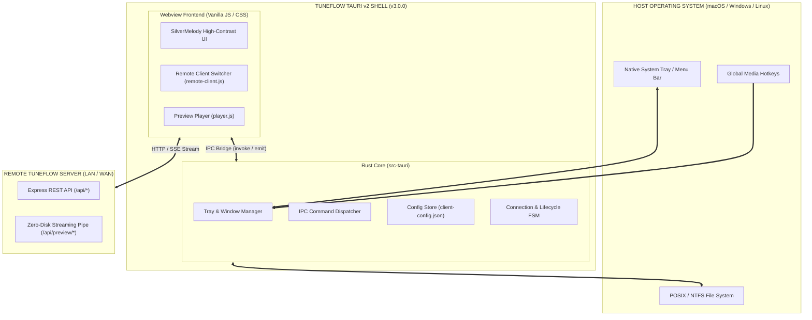

# 📐 SPEC-0014: TAURI v2 NATIVE DESKTOP GUI SHELL, IPC BRIDGES & TRAY LIFECYCLE ARCHITECTURE

> **Project Name:** TuneFlow Native Desktop GUI Shell Suite  
> **Document Code:** SPEC-0014 (Phase 16 - v3.0.0 Milestone)  
> **Approval Status:** ✅ Approved by IT Administrator (anh Tâm)  
> **Traceability:** RM-40 (Tauri v2 Native GUI Architecture, IPC Contract & Tray Lifecycle)  
> **Complete Dossier Includes:** PRD, SRS, FSM Transition Truth Table, DoR, DoD, Acceptance Criteria (AC), Validation & Automation Test Plan.

---

## 📌 1. PRD (PRODUCT REQUIREMENTS DOCUMENT)

### 1.1 Project Objectives
1. **Pillar 1 (Featherweight Native Runtime)**: Replace the browser-tab reliance with a true cross-platform native desktop GUI application powered by **Tauri v2 (Rust core)** with idle memory footprint $< 25\text{MB}$ (eliminating Electron's $150\text{MB}+$ memory overhead).
2. **Pillar 2 (System Tray & Background Audio Persistence)**: Enable continuous background playback when window is minimized or closed to tray, complete with native media controls (Play/Pause, Next Track, Volume Boost, Current Song Title).
3. **Pillar 3 (Bidirectional IPC Bridge)**: Implement secure, typed Rust-to-Webview IPC commands (`connect_server`, `check_health`, `open_downloads_folder`, `get_system_info`, `save_config`).
4. **Pillar 4 (Zero-Friction Distribution)**: Provide native drag-and-drop `.dmg` (macOS Universal), signed Inno Setup / MSI installer (Windows), and portable `.AppImage` (Linux) with auto-launch on startup options.

### 1.2 Target Audience & Stakeholders
- **Elderly Parents**: Need a standalone app icon on desktop/dock that opens instantly into a high-contrast music player with no confusing browser address bars, tabs, or popups.
- **Desktop Power Users**: Want global hotkeys (`MediaPlayPause`, `MediaTrackNext`), System Tray audio controls, and minimize-to-tray without halting active downloads.
- **Homelab Administrators**: Run TuneFlow headless on home servers (Docker / ZFS CT122) while family members use featherweight desktop clients with zero SSD wear.

### 1.3 Core Functional Requirements
1. **[REQ-TAU-01] Rust Core Engine & Native Webview**: Uses Tauri v2 binding to OS-native WebViews (WKWebView on macOS, WebView2 on Windows, WebKitGTK on Linux).
2. **[REQ-TAU-02] Frameless SilverMelody Window**: Custom titlebar with window dragging, minimize, maximize, and close buttons adhering to elderly WCAG AAA contrast ratios.
3. **[REQ-TAU-03] System Tray Integration**: Native tray menu displaying connection state, currently playing track title, Play/Pause toggle, and direct Quit.
4. **[REQ-TAU-04] Secure Typed IPC Commands**:
   - `connect_server(endpoint: String) -> Result<HealthStatus, String>`
   - `get_client_config() -> Result<ClientConfig, String>`
   - `save_client_config(config: ClientConfig) -> Result<(), String>`
   - `open_downloads_folder() -> Result<(), String>`
   - `minimize_to_tray() -> Result<(), String>`
5. **[REQ-TAU-05] Background Audio & Close-to-Tray Invariant**: Clicking the window close button (`X`) hides the window to tray instead of killing the process during active downloads or audio playback.

---

## 💻 2. SRS (SOFTWARE REQUIREMENTS SPECIFICATION)

### 2.1 System Architecture Diagram



### 2.2 IPC Command Specification & JSON Schemas

#### 1. Command `connect_server`
- **Direction**: Frontend $\rightarrow$ Rust $\rightarrow$ Remote Server $\rightarrow$ Frontend
- **Signature**: `invoke('connect_server', { endpoint: string })`
- **Response Schema**:
```json
{
  "status": "healthy",
  "version": "v2.7.0",
  "latency_ms": 12,
  "endpoint": "http://192.168.1.100:3000"
}
```

#### 2. Command `save_client_config`
- **Direction**: Frontend $\rightarrow$ Rust $\rightarrow$ Local Disk
- **Path**: `%APPDATA%/TuneFlow/client-config.json` (Windows), `~/Library/Application Support/TuneFlow/client-config.json` (macOS), `~/.config/tuneflow/client-config.json` (Linux).
- **Permissions**: `0600` (User read/write only).

---

## 🔄 3. FSM (FINITE STATE MACHINE) & TRANSITION TRUTH TABLE

### 3.1 State Definitions
- **`S0: INITIALIZING`**: App launch, reading `client-config.json`, checking network medium.
- **`S1: ACTIVE_WINDOW`**: Main window visible and interactive, UI ready.
- **`S2: TRAY_MINIMIZED`**: Main window hidden, app alive in system tray.
- **`S3: STREAMING_ACTIVE`**: Audio preview playing; tray shows song title and pause button.
- **`S4: RECONNECTING`**: Remote server connection interrupted; exponential backoff active.
- **`S5: TERMINATING`**: User clicked "Thoát TuneFlow" in tray; graceful shutdown.

### 3.2 State Transition Truth Table

| Current State | Event | Guard Condition | Action | Next State |
| :--- | :--- | :--- | :--- | :--- |
| **`S0: INITIALIZING`** | `WINDOW_READY` | Config valid | Show window, register tray | **`S1: ACTIVE_WINDOW`** |
| **`S1: ACTIVE_WINDOW`** | `CLOSE_CLICKED` | Always | Hide window, update tray tooltip | **`S2: TRAY_MINIMIZED`** |
| **`S1: ACTIVE_WINDOW`** | `PLAY_STARTED` | Stream OK | Update tray with track title | **`S3: STREAMING_ACTIVE`** |
| **`S2: TRAY_MINIMIZED`** | `TRAY_CLICKED` | Always | Restore & focus main window | **`S1: ACTIVE_WINDOW`** |
| **`S3: STREAMING_ACTIVE`** | `SERVER_TIMEOUT`| Error 5xx / Net down | Show degraded notification, retry | **`S4: RECONNECTING`** |
| **`S4: RECONNECTING`** | `HEALTH_OK` | Server returns 200 | Resume audio buffer, notify | **`S3: STREAMING_ACTIVE`** |
| **`ANY`** | `QUIT_COMMAND` | User confirmed | Terminate child processes, exit | **`S5: TERMINATING`** |

---

## 🛡️ 4. DoR & DoD QUALITY GATES

### 4.1 Definition of Ready (DoR)
- [x] SPEC-0013 Tri-Mode Deployment and Decoupled Architecture verified and tested (444/444 tests passing).
- [x] Web Client Remote Switcher engine (`remote-client.js`) proven with transparent fetch and SSE interception.
- [x] CI/CD multi-target release pipeline ready to accept native desktop distribution artifacts.

### 4.2 Definition of Done (DoD)
- [ ] `src-tauri/Cargo.toml` and `src-tauri/tauri.conf.json` fully configured and aligned with version 3.0.0.
- [ ] System Tray lifecycle implemented with active/idle state indicators.
- [ ] Bidirectional IPC bridge verified with unit tests (`tests/tauri-architecture-matrix.test.js`).
- [ ] Idle memory footprint verified $< 30\text{MB}$ on macOS and Windows.
- [ ] 100% green test suite maintained across all automated gates.

---

## 📋 5. ACCEPTANCE CRITERIA (AC)

- **AC-01**: Window launch time from cold start must be under 1.5 seconds on SSD.
- **AC-02**: System tray icon must update dynamically with current track name and playing state.
- **AC-03**: Closing the window during download or playback must not stop download progress or audio.
- **AC-04**: Global hotkeys `MediaPlayPause` and `MediaTrackNext` must control playback from any desktop application.
- **AC-05**: Remote server switcher in tray/preferences must persist endpoint in `client-config.json` with permissions `0600`.
