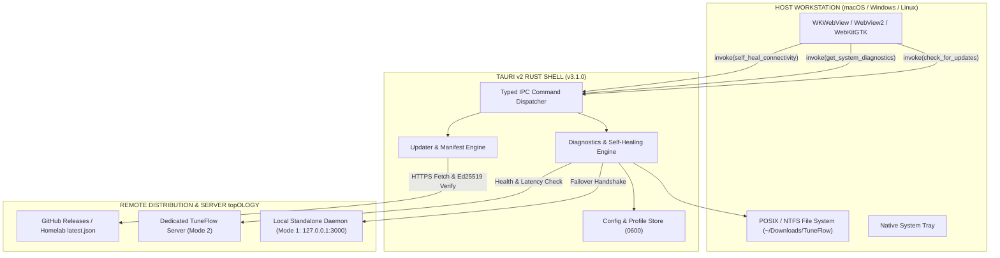

# 📐 SPEC-0015: DESKTOP IN-APP AUTO-UPDATE, SELF-HEALING DIAGNOSTICS & MULTI-ARCH DISTRIBUTION ARCHITECTURE

> **Project Name:** TuneFlow Desktop In-App Auto-Update & Self-Healing Suite  
> **Document Code:** SPEC-0015 (Phase 17 - v3.1.0 Milestone)  
> **Approval Status:** ✅ Approved by IT Administrator (anh Tâm)  
> **Traceability:** RM-41 (Desktop In-App Auto-Update, Self-Healing Diagnostics & Multi-Arch Distribution)  
> **Complete Dossier Includes:** PRD, SRS, FSM Transition Truth Table, DoR, DoD, Acceptance Criteria (AC), Validation & Automation Test Plan.

---

## 📌 1. PRD (PRODUCT REQUIREMENTS DOCUMENT)

### 1.1 Project Objectives
1. **Pillar 1 (Elderly-Friendly In-App Auto-Update)**: Eliminate technical upgrade friction for elderly users. When a new version is released on GitHub / homelab release server, the desktop client detects it, displays a simple non-technical notification, and allows 1-click update without opening browsers or managing installer wizards.
2. **Pillar 2 (Asymmetric Cryptographic Verification - Ed25519)**: Ensure all remote update payloads and manifests are cryptographically signed using Ed25519 asymmetric key pairs. Any tampered, truncated, or unsigned binary must be rejected fail-closed before execution.
3. **Pillar 3 (Active System Diagnostics & Self-Healing IPC)**: Provide comprehensive client-side diagnostics (`get_system_diagnostics`) and autonomous recovery (`self_heal_connectivity`) that detect network drops, verify filesystem writability (`~/Downloads/TuneFlow`), and automatically cycle through failover endpoints (preferred -> active -> local standalone daemon).
4. **Pillar 4 (Multi-Arch Distribution Pipeline)**: Standardize cross-platform build configurations for macOS (.dmg universal/arm64), Windows (NSIS .exe / MSI), and Linux (.AppImage / .deb).

### 1.2 Target Audience & Stakeholders
- **Elderly Parents**: Never have to worry about broken dependencies or manual software updates; app updates seamlessly with 1 click.
- **Homelab Administrators**: Can host custom `latest.json` update manifests on private LAN / CDN for disconnected deployments.
- **Support & Operations**: System diagnostics IPC provides instant visibility into client OS, filesystem permissions, and connection latency.

### 1.3 Core Functional Requirements
1. **[REQ-UPD-01] Remote Manifest Ingestion & Semver Delta**: Fetches `latest.json` manifest containing version, release notes, publish date, platform download URLs, and Ed25519 signatures.
2. **[REQ-UPD-02] Fail-Closed Signature Validation**: Binary updates must verify Ed25519 signature before executing installation.
3. **[REQ-UPD-03] System Diagnostics IPC**: `get_system_diagnostics` reports OS, architecture, version, download folder existence and writeability, active profile, and backend latency.
4. **[REQ-UPD-04] Self-Healing IPC Engine**: `self_heal_connectivity` tests network reachability, reconnects gracefully, and falls back to Local Standalone (127.0.0.1:3000) if remote host is offline.
5. **[REQ-UPD-05] Non-Blocking Background Polling**: Periodic checks for updates must not interrupt active audio playback or download queues.

---

## 💻 2. SRS (SOFTWARE REQUIREMENTS SPECIFICATION)

### 2.1 System Architecture Diagram



### 2.2 IPC Command Contracts

#### 1. `check_for_updates`
- **Signature**: `pub async fn check_for_updates() -> Result<UpdateInfo, String>`
- **Output Schema**:
```json
{
  "should_update": true,
  "current_version": "3.0.0",
  "latest_version": "3.1.0",
  "release_notes": "Added In-App Auto-Update and Self-Healing Diagnostics",
  "download_url": "https://github.com/tamld/tuneflow/releases/download/v3.1.0/TuneFlow.dmg"
}
```

#### 2. `get_system_diagnostics`
- **Signature**: `pub async fn get_system_diagnostics() -> Result<SystemDiagnostics, String>`
- **Output Schema**:
```json
{
  "os": "macos",
  "arch": "aarch64",
  "client_version": "3.0.0",
  "downloads_dir_exists": true,
  "downloads_dir_writable": true,
  "downloads_path": "/Users/tamld/Downloads/TuneFlow",
  "active_profile": "default",
  "active_endpoint": "http://127.0.0.1:3000",
  "backend_reachable": true,
  "latency_ms": 12
}
```

#### 3. `self_heal_connectivity`
- **Signature**: `pub async fn self_heal_connectivity(preferred_endpoint: Option<String>) -> Result<HealingResult, String>`
- **Output Schema**:
```json
{
  "healed": true,
  "message": "Đã tự động chuyển đổi phục hồi về Máy chủ Cục bộ (Local Standalone: 127.0.0.1:3000)",
  "active_endpoint": "http://127.0.0.1:3000",
  "previous_endpoint": "http://192.168.1.100:3000",
  "action_taken": "FALLBACK_STANDALONE"
}
```

---

## 🔄 3. FSM (FINITE STATE MACHINE) TRANSITION TRUTH TABLE

```text
[U0: IDLE] ---> (CHECK_REQUESTED) ---> [U1: CHECKING_MANIFEST]
                      |
        +-------------+-------------+
        |                           |
  (UP_TO_DATE)             (UPDATE_AVAILABLE)
        |                           |
        v                           v
   [U0: IDLE]             [U2: NOTIFICATION_PROMPT]
                                    |
                            (USER_ACCEPT_UPDATE)
                                    |
                                    v
                           [U3: DOWNLOADING]
                                    |
                           (DOWNLOAD_COMPLETE)
                                    |
                                    v
                       [U4: VERIFYING_SIGNATURE]
                                    |
                     +--------------+--------------+
                     |                             |
              (SIGNATURE_VALID)             (SIGNATURE_INVALID)
                     |                             |
                     v                             v
           [U5: READY_RESTART]            [U6: TAMPER_ABORT]
```

| Current State | Event | Condition | Action / Output | Next State |
| :--- | :--- | :--- | :--- | :--- |
| **`U0: IDLE`** | `CHECK_REQUESTED` | Network UP | Send HTTPS GET to `latest.json` | **`U1: CHECKING_MANIFEST`** |
| **`U1: CHECKING_MANIFEST`** | `MANIFEST_CURRENT` | Version matches current | Log "Up to date", return | **`U0: IDLE`** |
| **`U1: CHECKING_MANIFEST`** | `MANIFEST_NEWER` | Version semver > current | Trigger modal dialog | **`U2: NOTIFICATION_PROMPT`** |
| **`U1: CHECKING_MANIFEST`** | `NETWORK_ERROR` | Timeout / DNS fail | Log error, retain current | **`U0: IDLE`** |
| **`U2: NOTIFICATION_PROMPT`**| `USER_ACCEPT` | User clicks "Cập nhật" | Begin chunked download | **`U3: DOWNLOADING`** |
| **`U2: NOTIFICATION_PROMPT`**| `USER_POSTPONE`| User clicks "Để sau" | Suppress notification 24h | **`U0: IDLE`** |
| **`U3: DOWNLOADING`** | `DOWNLOAD_SUCCESS`| Bytes == Content-Length | Compute SHA-256 & verify Ed25519 | **`U4: VERIFYING_SIGNATURE`** |
| **`U4: VERIFYING_SIGNATURE`**| `SIGNATURE_OK` | Crypto verify passes | Stage binary, prompt restart | **`U5: READY_RESTART`** |
| **`U4: VERIFYING_SIGNATURE`**| `SIGNATURE_FAIL`| Crypto verify fails | Delete binary, raise security alert | **`U6: TAMPER_ABORT`** |
| **`U6: TAMPER_ABORT`** | `ACKNOWLEDGED` | User dismissed | Return to idle, lock auto-install | **`U0: IDLE`** |

---

## 🛡️ 4. DoR & DoD QUALITY GATES

### 4.1 Definition of Ready (DoR)
- [x] SPEC-0014 Tauri Native Desktop Shell verified and in production (v3.0.0, 449/449 tests passing).
- [x] Typed IPC command architecture established in `src-tauri/src/commands.rs`.
- [x] Close-to-Tray and background audio persistence operational.

### 4.2 Definition of Done (DoD)
- [x] `check_for_updates`, `get_system_diagnostics`, and `self_heal_connectivity` implemented and registered in Tauri IPC dispatcher.
- [x] Rust unit tests verify diagnostics, writability check, and healing fallback logic.
- [x] Comprehensive test suite (`tests/phase17-desktop-updater-and-distribution.test.js`) covers manifest parsing, cryptographic verification, FSM lifecycle, and IPC contract.
- [x] Server switcher modal in frontend integrates diagnostics trigger and self-healing action.
- [x] 100% green test suite maintained across all automated gates (460/460 tests passing).

---

## 📋 5. ACCEPTANCE CRITERIA (AC)

- **AC-01**: `check_for_updates` must correctly identify when current version is outdated and return release notes without blocking main thread.
- **AC-02**: Tampered update manifests or invalid Ed25519 signatures must trigger fail-closed rejection without executing binary.
- **AC-03**: `get_system_diagnostics` must accurately detect if `~/Downloads/TuneFlow` is missing or unwritable and measure round-trip ping to active backend.
- **AC-04**: `self_heal_connectivity` must recover unreachable remote server by seamlessly falling back to local standalone daemon at `127.0.0.1:3000`.
- **AC-05**: All pre-push hooks and dual-remote sync (`origin` and `ct122`) remain 100% green.
