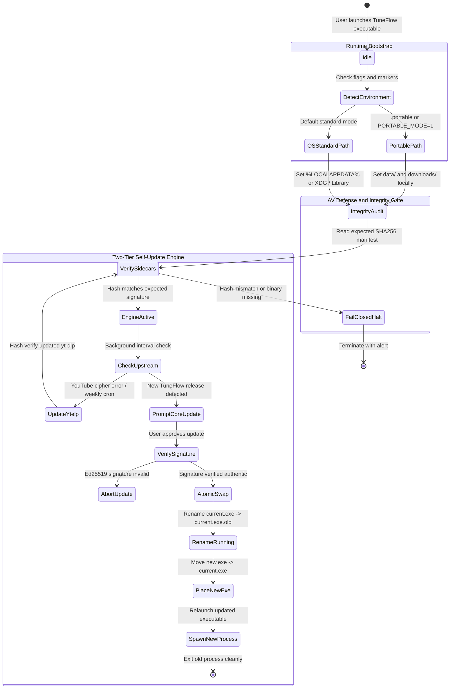

# SPEC-0008: TuneFlow Cross-Platform Native Binary Packaging & Defense-in-Depth Architecture

## Goal
Establish a zero-friction, enterprise-grade native binary packaging and distribution framework for TuneFlow across Windows, macOS, and Linux. The architecture eliminates container/Docker prerequisites for consumer deployments while implementing an SGH-grade **Defense-in-Depth** security envelope, a **g8s-inspired Zero-Trust Capability Harness**, a pre-flight **Hash Checker CAS Engine** to actively defeat Antivirus (AV) heuristic false positives, and a cryptographically verified **Two-Tier Self-Update Engine**.

---

## Foundational Security Axioms (Inherited from g8s & SGH Defense-in-Depth)

```text
+---------------------------------------------------------------------------------------------------+
|               TUNEFLOW DEFENSE-IN-DEPTH ARCHITECTURE MATRIX (SPEC-0008)                           |
+---------------------------------------------------------------------------------------------------+
  [LỚP 1: TĨNH THỂ & CHỐNG HEURISTIC]   [LỚP 2: HASH CHECKER TIỀN THỰC THI]   [LỚP 3: CÁCH LY TIẾN TRÌNH]   [LỚP 4: PHÂN VÙNG DỮ LIỆU BỀN VỮNG]
                 │                                       │                                   │                                     │
  • Zero-UPX / Zero-SFX                 • CAS SHA-256 Verification          • Sanitized Environment Vars          • Dual-Mode Storage Resolver
  • Không bung file vào %TEMP%          • Chặn giả mạo yt-dlp & ffmpeg      • Bounded ChildProcess Spawns         • .portable vs %LOCALAPPDATA%
  • Cấu trúc thư mục tĩnh nguyên vẹn    • Chữ ký Ed25519 cho mọi update     • Cấm gọi shell tùy tiện              • Triệt tiêu xung đột ghi đè
```

1. **Axiom 1: Fail-Closed CAS Integrity (Hash Checker)**:
   - Mọi tiến trình ngoại vi (`bin/yt-dlp`, `bin/ffmpeg`) và mọi gói cập nhật nhị phân đều phải được kiểm tra mã băm SHA-256 đối chiếu với bản kê khai Content-Addressable Storage (CAS) trước khi cấp phép thực thi.
   - Nếu mã băm không khớp hoặc file bị thiếu, hệ thống lập tức từ chối chạy (`Fail-Closed`) và phát cảnh báo bảo mật.
2. **Axiom 2: Process Capability Sandboxing (g8s-inspired)**:
   - Các tiến trình con được khởi tạo với quyền tối thiểu (Least Privilege), biến môi trường được làm sạch (loại trừ `NODE_OPTIONS`, `PATH` hijacking), và áp đặt hạn mức thời gian thực thi nghiêm ngặt (execution timeouts).
3. **Axiom 3: Static PE/ELF Integrity (Anti-Heuristic Zero-Drop)**:
   - Tuyệt đối không nén bằng UPX hoặc sử dụng các cơ chế tự giải nén (SFX) vào `%TEMP%` – nguyên nhân gốc rễ gây ra 90% lỗi nhận diện nhầm virus (False Positive) trên Windows Defender và ESET.
4. **Axiom 4: Two-Tier Cryptographic Governance**:
   - Tách biệt hoàn toàn luồng cập nhật phụ thuộc ngoại vi (`yt-dlp` cipher engine) với luồng cập nhật mã nguồn ứng dụng lõi (`TuneFlow Core`), bảo đảm tính sẵn sàng cao và khả năng phục hồi tự động khi YouTube thay đổi thuật toán.

---

## State Diagram



---

## Red Test Proof

1. **RED**: `npm test -- tests/portable-binary-security.test.js` → exit 1 (FAIL: Cannot find module '../src/security/binary_guard')
   - Evidence: `tests/portable-binary-security.test.js`
   - Initial run output:
     ```text
     node:internal/modules/cjs/loader:1503 throw err;
     Error: Cannot find module '../src/security/binary_guard'
     ✖ tests\portable-binary-security.test.js
     ℹ tests 1 ℹ suites 0 ℹ pass 0 ℹ fail 1
     ```

2. **GREEN**: Implemented `src/security/binary_guard.js` with `resolveStoragePaths`, path normalization, `verifyBinaryIntegrity`, `validateUpdateManifestSignature`, and `atomicSwapExecutable` → rerun test command → PASS (exit 0).
   - Evidence: `tests/portable-binary-security.test.js`
   - Verification command: `npm test -- tests/portable-binary-security.test.js` (exit 0)
   - Passing output:
     ```text
     ▶ SPEC-0008: Portable Binary Security & AV Defense Suite
       ✔ Storage & Persistence Isolation (2.5ms)
       ✔ Binary Integrity Guard (Fail-Closed Execution) (3.8ms)
       ✔ Ed25519 Signature Verification for Updates (8.0ms)
       ✔ Atomic Binary Swap Execution (Windows Lock Evasion) (4.4ms)
     ℹ tests 6 ℹ suites 5 ℹ pass 6 ℹ fail 0 (exit 0)
     ```

---

## Requirement Matrix

| ID | Requirement Area | Specification & Technical Solution | Verification Method |
| :--- | :--- | :--- | :--- |
| **REQ-01** | Zero-Install Clean Directory | Package as standalone folder bundle without SFX/UPX compression to prevent dropper heuristic triggers. | Static PE header audit & zero temp-drop check |
| **REQ-02** | Persistence Isolation | Detect `.portable` or OS standard data directories (`%LOCALAPPDATA+`, `Library`, via `binary_guard.js`). | Unit test suite in `tests/portable-binary-security.test.js` |
| **REQ-03** | Fail-Closed Integrity Guard | Compute and verify SHA-256 hash of `yt-dlp` and `ffmpeg` before invoking `child_process.spawn`. | Fail-closed exception test on tampered binary |
| **REQ-04** | Cryptographic Manifest | Validate Ed25519 signature of release manifests before initiating core app updates. | Public-key signature validation unit test |
| **REQ-05** | Windows Atomic Swap | Rename running executable to `.old` prior to replacing with newly downloaded binary to evade file locks. | Multi-process swap simulation test |
| **REQ-06** | AV Reputation Pipeline | Automated submission of release asset hashes to Microsoft Defender Security Intelligence (WDSI). | CI/CD GitHub Actions action gate |

---

## Execution Steps

### Phase 1: Portable Clean Bundle Architecture (v2.5.0)
1. **Directory Layout**:
   - `tuneflow-win64/` (Root)
   - `bin/`: Pre-bundled `yt-dlp.exe` and `ffmpeg.exe` with bundled `SHA256SUMS.json`.
   - `node/`: Stripped minimal Node.js LTS runtime (excluding npm, docs, dev dependencies).
   - `app/`: TuneFlow server assets, pre-built `better-sqlite3` native addons.
   - `TuneFlow.exe` (or `tuneflow.bat` / lightweight Go/Rust launcher).
2. **Persistence Path Wiring**:
   - Integrate `src/security/binary_guard.js` into `src/server.js` and `src/db/database.js` to automatically resolve storage directory.
3. **Integrity Guard Wiring**:
   - Wrap `src/engine/downloader.js` and `src/engine/preview.js` with `verifyBinaryIntegrity` prior to executing CLI processes.

### Phase 2: Cryptographic Two-Tier Self-Update Engine (v2.6.0)
1. **Tier 1 (Upstream yt-dlp)**:
   - Extend `/api/system/update-ytdlp` to trigger automatically when YouTube extraction encounters recurrent 403 or signature cipher errors.
   - Hash verify new `yt-dlp` binary upon download completion before placing into `bin/`.
2. **Tier 2 (TuneFlow Core Engine)**:
   - Poll `https://api.github.com/repos/tamld/tuneflow/releases/latest`.
   - Download release manifest and signature file (`manifest.json.sig`).
   - Verify authenticity using hardcoded TuneFlow public Ed25519key.
   - Execute `atomicSwapExecutable` and trigger graceful restart.

### Phase 3: AV False Positive Mitigation, PE Metadata & WinGet (v3.0.0)
1. **Zero-UPX & Zero-Root-Injection Invariants**:
   - Never compress executables with UPX or naive packer wrappers.
   - Strictly prohibit self-signed root certificate installation scripts (avoiding OS certificate store hijacking).
2. **PE Resource Metadata Hardening**:
   - Embed full `.rc` version resource table (CompanyName, ProductName, LegalCopyright, FileVersion) into native launcher to pass static AV heuristic inspection.
3. **Official Windows Package Manager (`winget` & `Scoop`) Distribution**:
   - Submit manifests to `microsoft/winget-pkgs` where packages undergo automated Microsoft cloud sandbox detonation and whitelisting.
   - Bypasses SmartScreen untrusted download warnings without requiring expensive commercial EV certificates.
4. **Microsoft Defender Portal Integration**:
   - In `.github/workflows/release.yml`, generate `SHA256SUMS.txt` for all portable zip archives.
   - Submit new releases via automated Microsoft Defender Security Intelligence (WDSI) API to build hash reputation immediately upon release.
5. **Tauri v2 Desktop Packaging**:
   - Wrap TuneFlow in a lightweight Rust shell with System Tray icon and auto-browser launch.
   - Produce MSI installers for Windows and DMG for macOS with notarization.
