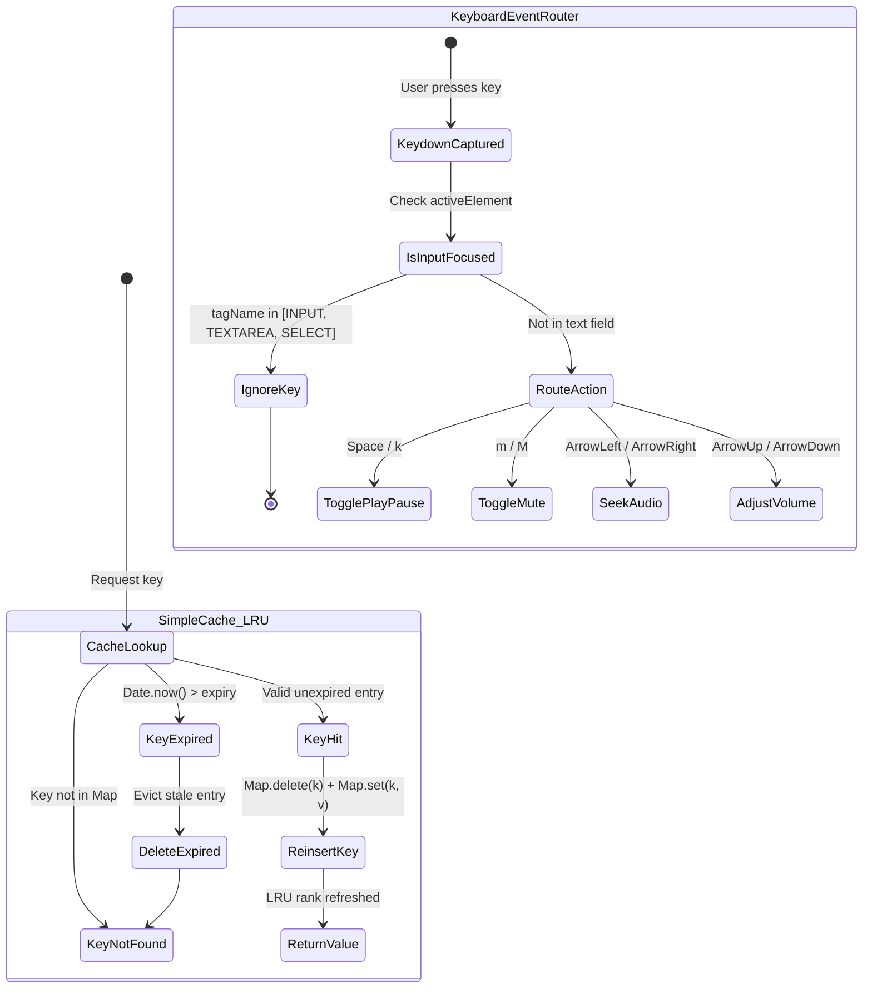

# Plan: System Design Primer Optimizations — True LRU, Dynamic Stream TTL, Static Cache-Control & Senior Keyboard Navigation

> **For autonomous agent execution (/goal):** Implement this plan task-by-task following Red-Green TDD and verifiable quality gates. Track progress using checkbox (`- [ ]`) syntax.  
> **Reference Issue**: [Issue #97](https://github.com/tamld/tuneflow/issues/97)  
> **Target Release**: TuneFlow v2.4.3  

---

## 1. Context, Architecture & Socratic Inversion Review

Following the **System Design Primer** audit and `/wiki-socratic` failure inversion analysis:
1. **Cache Layer Invariants (Issue #97.1)**:
   - *Current Flaw*: `SimpleCache` in `src/engine/ytdlp.js` does not re-insert keys on read hits, behaving as FIFO rather than True LRU. `streamUrlCache` has a static 2-hour TTL which drifts from YouTube's upstream `expire=<timestamp>` parameter, inducing stale 403 Forbidden errors.
   - *Architecture Fix*: Enhance `SimpleCache` with True LRU eviction ($O(1)$ re-insertion on `get()`). Implement dynamic TTL extraction from YouTube stream URLs using regex parsing on `expire=` parameter with a 60-second safety margin.
2. **Static Asset Caching (Issue #97.2)**:
   - *Current Flaw*: `express.static` lacks explicit `maxAge`, forcing browsers to re-verify assets on every reload.
   - *Socratic Inversion Verdict*: Adding generic `compression` middleware is **rejected** because buffering chunked binary audio streams destroys live audio streaming TTFB. Instead, configure native `express.static` with `maxAge: '1d', etag: true` (zero new dependencies, zero streaming interference).
3. **Senior Usability & Keyboard Shortcuts (Issue #97.3)**:
   - *Current Flaw*: Elderly desktop users must manually aim their cursor at small player buttons in the bottom player bar to pause or adjust volume.
   - *Architecture Fix*: Global keyboard shortcuts (`Space`/`k` for Play/Pause, `m` for Mute/Unmute, `←`/`→` for Seek ±5s, `↑`/`↓` for Volume ±5%), strictly guarded so they never intercept typing when an `<input>` or `<textarea>` is focused.

---

## 2. FSM State Diagram (Cache Lifecycle & Keyboard Event Routing)



---

## 3. Definition of Ready (DoR) Checklist

- [x] Issue #97 opened with explicit problem statement and acceptance criteria.
- [x] Socratic Inversion executed: Heavy Gzip middleware rejected to protect audio chunk streams; Durable SQLite queue rejected to protect SD card IOPS on homelab SBCs.
- [x] Baseline test suite passes 100% (218/218 tests passing, 0 lint errors on master branch).
- [x] Topic branch strategy planned: `feat/system-design-lru-cache-and-a11y`.

---

## 4. Implementation Tasks (Red-Green TDD Workflow)

### Task 1: Scaffolding Red Tests for True LRU & Dynamic Stream TTL
- **Deliverable**: `tests/cache-lru-and-ttl.test.js`
- **Test Scenarios**:
  1. `should evict least recently used item when capacity is exceeded, not first inserted item` (True LRU test).
  2. `should refresh entry rank upon get() cache hit` (LRU read access test).
  3. `should parse expire timestamp from YouTube CDN URL and calculate dynamic TTL` (Upstream TTL test).
  4. `should fall back to safe default TTL when stream URL lacks expire parameter`.
- **Target Command**: `node --test tests/cache-lru-and-ttl.test.js` (Must be RED before Task 2).

### Task 2: Implement True LRU & Dynamic Stream TTL in `src/engine/ytdlp.js`
- **Deliverable**: `src/engine/ytdlp.js`
- **Changes**:
  - Update `SimpleCache.prototype.get`:
    ```javascript
    get(key) {
      const entry = this.cache.get(key);
      if (!entry) return null;
      if (Date.now() > entry.expiry) {
        this.cache.delete(key);
        return null;
      }
      this.cache.delete(key);
      this.cache.set(key, entry);
      return entry.value;
    }
    ```
  - Add helper `extractStreamUrlTtl(streamUrl, defaultTtlMs)` parsing `/[?&]expire=(\d+)/` to calculate dynamic TTL with a 60s safety buffer.
  - Wire dynamic TTL into `getPreviewStreamUrl()`.
- **Verification**: `node --test tests/cache-lru-and-ttl.test.js` (Must turn GREEN).

### Task 3: Static Asset Caching in `src/server.js`
- **Deliverable**: `src/server.js`
- **Changes**:
  - Update static server middleware:
    ```javascript
    app.use(express.static(path.join(ROOT_DIR, 'public'), {
      maxAge: '1d',
      etag: true
    }));
    ```
- **Verification**: `node --test tests/api.test.js` (Assert 200/304 response compatibility).

### Task 4: Scaffolding Red Tests for Senior Keyboard Navigation
- **Deliverable**: `tests/keyboard-shortcuts.test.js`
- **Test Scenarios**:
  1. `should ignore keyboard shortcuts when document.activeElement is an INPUT or TEXTAREA`.
  2. `should route Space and k to player togglePlayPause()`.
  3. `should route m to player toggleMute()`.
  4. `should route ArrowLeft / ArrowRight to player seekAudio(-5 / +5)`.
  5. `should route ArrowUp / ArrowDown to player adjustVolume(+0.05 / -0.05)`.
- **Target Command**: `node --test tests/keyboard-shortcuts.test.js` (Must be RED before Task 5).

### Task 5: Implement Global Keyboard Navigation in `public/js/app.js`
- **Deliverable**: `public/js/app.js`
- **Changes**:
  - Add senior keyboard shortcut listener:
    - Check if active element is input, textarea, or contentEditable.
    - Intercept `Space`, `k`, `m`, `ArrowLeft`, `ArrowRight`, `ArrowUp`, `ArrowDown`.
    - Trigger existing player methods (`window.togglePlayPause()`, `window.toggleMute()`, seek and volume helpers).
    - Prevent default scrolling behavior on `Space` and arrow keys only when audio player is active.
- **Verification**: `node --test tests/keyboard-shortcuts.test.js` (Must turn GREEN).

### Task 6: Full Verification, Documentation & CI/CD Readiness
- **Deliverable**: `tests/*.test.js`, `CHANGELOG.md`
- **Steps**:
  - Run `node --test tests/*.test.js` (All $\ge 225$ tests passing green).
  - Run `node node_modules/eslint/bin/eslint.js src/ public/js/` (0 errors, 0 warnings).
  - Update `CHANGELOG.md` for v2.4.3.
  - Push branch, open PR #98, squash-merge into `master`.

---

## 5. Definition of Done (DoD) Checklist

- [ ] All new test files (`cache-lru-and-ttl.test.js`, `keyboard-shortcuts.test.js`) pass 100%.
- [ ] Existing 218 test cases continue to pass with 0 regressions ($\ge 225$ total tests).
- [ ] ESLint clean across all modified files.
- [ ] Zero broken links in documentation.
- [ ] PR merged into `master` on GitHub with clean git history.
